# Agently 智能体架构设计

## 文档说明

本文档详细描述 Agently 的智能体架构设计，包括综合智能体、专业智能体以及它们的协作机制。

---

## 智能体架构概览

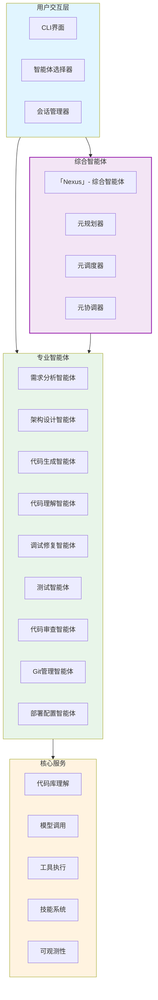

---

## 综合智能体：Nexus

### 名称哲学

**Nexus**（尼可斯）：
- **词源**：拉丁语，意为「连接点」、「中心点」、「交汇之处」
- **哲学含义**：
  - 代表软件开发的核心枢纽，连接需求与实现的桥梁
  - 象征多智能体协作的中心协调者，如同宇宙中星系的中心
  - 体现了「整体大于部分之和」的系统论思想
  - 寓意将分散的智能体能力整合为统一的智能体系

### 核心职责

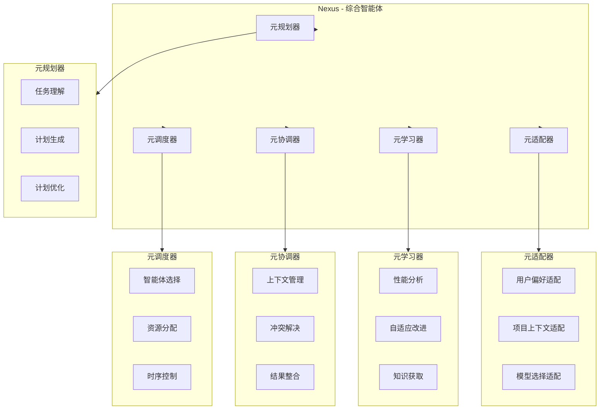

### 工作原理

1. **任务理解**：分析用户输入，理解任务需求和上下文
2. **计划生成**：创建多智能体协作计划，确定执行步骤
3. **智能体选择**：根据任务特点选择最合适的专业智能体
4. **执行协调**：调度智能体执行，管理上下文传递
5. **结果整合**：汇总各智能体的执行结果，形成最终方案
6. **学习优化**：分析执行效果，持续改进协作策略

---

## 专业智能体体系

### 智能体能力矩阵

| 智能体名称 | 核心能力 | 适用场景 | 依赖工具 |
|-----------|----------|----------|----------|
| 需求分析智能体 | 需求理解、结构化、风险评估 | 新功能开发、需求变更 | 文档分析、语义理解 |
| 架构设计智能体 | 代码库分析、架构设计、技术选型 | 系统设计、技术方案 | 代码分析、架构模板 |
| 代码生成智能体 | 代码生成、重构、文档生成 | 新功能实现、代码优化 | 代码模板、语言解析 |
| 代码理解智能体 | 代码分析、依赖识别、模式识别 | 代码审查、系统理解 | 静态分析、符号提取 |
| 调试修复智能体 | 错误分析、Bug定位、修复方案 | Bug修复、异常处理 | 错误分析、测试工具 |
| 测试智能体 | 测试生成、测试执行、覆盖率分析 | 质量保证、回归测试 | 测试框架、覆盖率工具 |
| 代码审查智能体 | 质量检查、安全检查、改进建议 | 代码评审、质量保证 | 静态分析、安全扫描 |
| Git管理智能体 | 分支管理、提交管理、PR管理 | 版本控制、团队协作 | Git操作、PR工具 |
| 部署配置智能体 | 配置生成、CI/CD设计、环境管理 | 部署发布、环境配置 | 配置模板、CI/CD工具 |

### 智能体协作模式

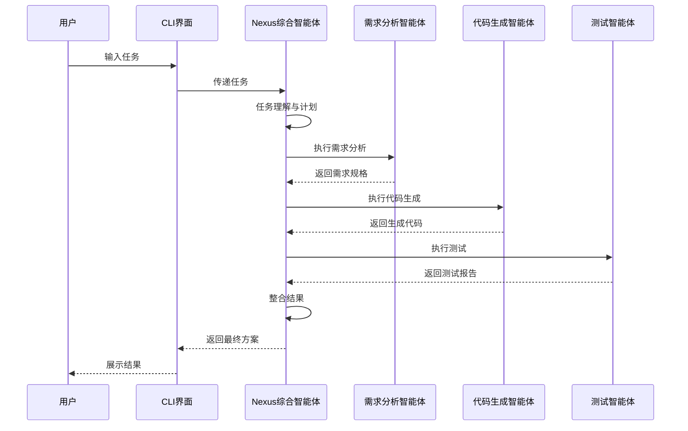

---

## CLI 智能体选择界面

### 命令结构

```
agently [command] [options]
```

### 智能体选择命令

| 命令 | 描述 | 示例 |
|------|------|------|
| `agent` | 选择智能体模式 | `agently agent` |
| `agent nexus` | 使用 Nexus 综合智能体 | `agently agent nexus` |
| `agent [name]` | 使用特定专业智能体 | `agently agent code-generator` |
| `agent list` | 列出所有可用智能体 | `agently agent list` |
| `agent info [name]` | 查看智能体详细信息 | `agently agent info nexus` |

### 智能体选择流程

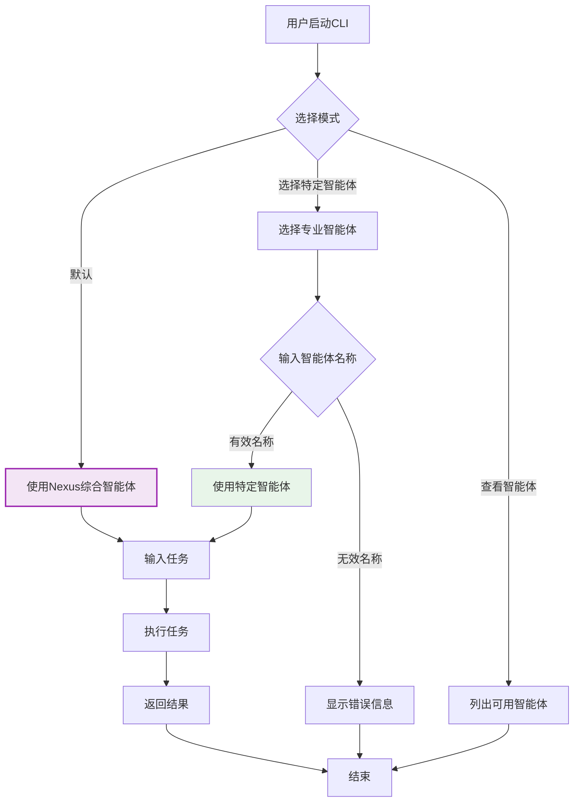

### 交互式选择界面

```
$ agently agent

Agently 智能体选择
==================

请选择智能体模式：

1. Nexus - 综合智能体（推荐）
   自动调度多个专业智能体协作完成复杂任务

2. 专业智能体
   选择特定领域的专业智能体

3. 查看智能体列表
   查看所有可用的智能体

请输入选项 [1-3]: 2

请选择专业智能体：

1. requirements-analyzer - 需求分析智能体
2. architecture-designer - 架构设计智能体
3. code-generator - 代码生成智能体
4. code-understander - 代码理解智能体
5. bug-fixer - 调试修复智能体
6. tester - 测试智能体
7. code-reviewer - 代码审查智能体
8. git-manager - Git管理智能体
9. deploy-configurator - 部署配置智能体

请输入智能体编号 [1-9]: 3

已选择：code-generator (代码生成智能体)

请输入您的代码生成需求：
```

---

## 智能体配置系统

### 配置层次

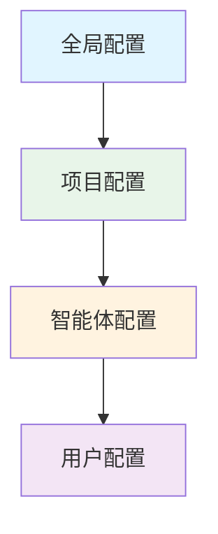

### 配置文件结构

```yaml
# 全局配置
global:
  models:
    default: openai
    providers:
      openai:
        api_key: "your-api-key"
      anthropic:
        api_key: "your-api-key"
  tools:
    timeout: 300
    max_retries: 3

# 项目配置
project:
  name: "agently"
  language: "python"
  framework: "langchain"
  code_style: "pep8"

# 智能体配置
agents:
  nexus:
    model: "gpt-4"
    timeout: 600
    max_workers: 5
  code-generator:
    model: "claude-3"
    timeout: 300
    code_style: "project"

# 用户配置
user:
  preferred_agent: "nexus"
  output_format: "markdown"
  auto_save: true
```

---

## 智能体学习与优化

### 学习机制

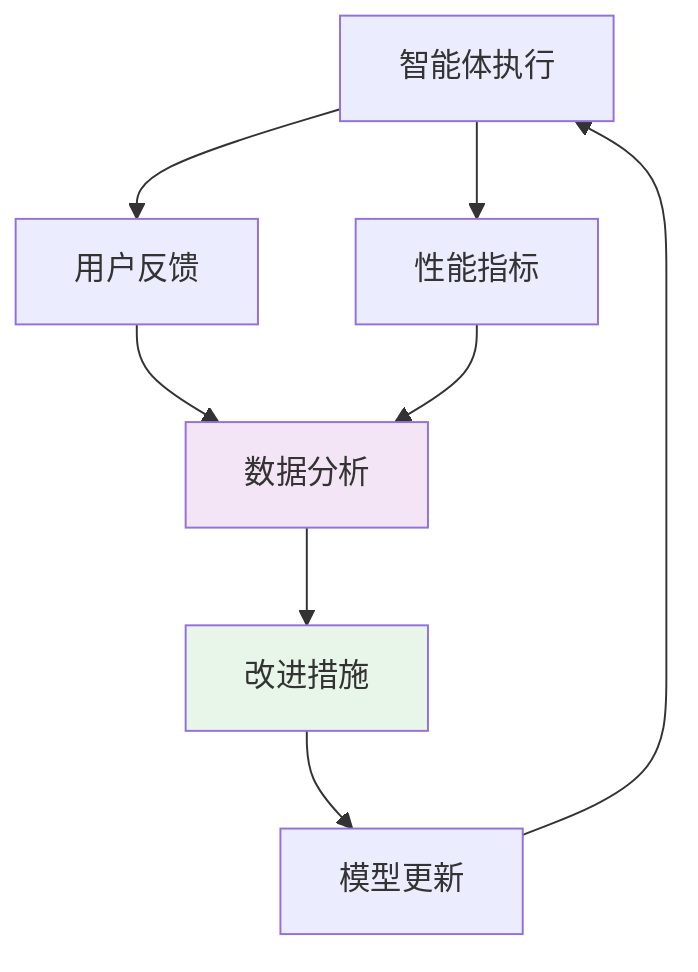

### 优化策略

1. **智能体选择优化**：基于历史执行效果，选择最适合特定任务的智能体
2. **模型选择优化**：根据任务类型和复杂度，自动选择最合适的模型
3. **协作策略优化**：调整智能体协作顺序和方式，提高执行效率
4. **提示工程优化**：基于反馈持续改进提示模板
5. **工具使用优化**：优化工具调用策略，减少不必要的调用

---

## 智能体扩展机制

### 自定义智能体开发

```python
from agently.agents.base import BaseAgent

class MyCustomAgent(BaseAgent):
    def __init__(self):
        super().__init__()
        self.name = "my-custom-agent"
        self.description = "自定义智能体"
        self.capabilities = ["custom-task"]
    
    def execute(self, task, context=None):
        # 实现智能体逻辑
        return result

# 注册智能体
from agently.agents.registry import register_agent
register_agent(MyCustomAgent())
```

### 智能体插件系统

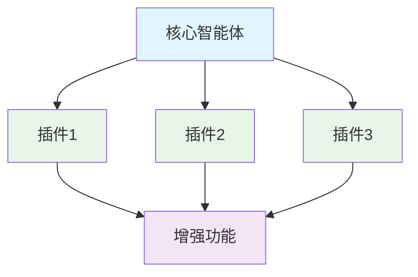

---

## 多智能体协作示例

### 新功能开发工作流

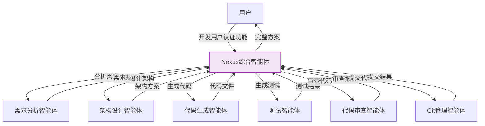

### Bug 修复工作流

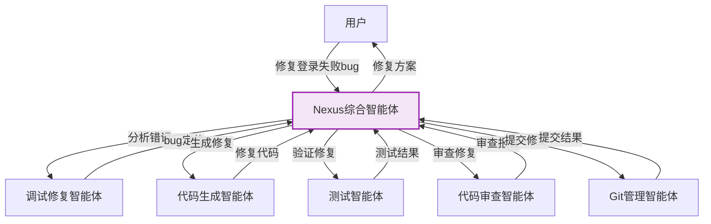

---

## 智能体性能监控

### 监控指标

| 指标 | 描述 | 单位 | 目标值 |
|------|------|------|--------|
| 执行时间 | 智能体执行任务的时间 | 秒 | < 30 |
| 成功率 | 任务成功完成的比例 | % | > 85 |
| 代码质量 | 生成代码的质量评分 | 0-100 | > 80 |
| 用户满意度 | 用户反馈的满意度 | 1-5 | > 4 |
| 工具调用次数 | 完成任务所需的工具调用次数 | 次 | < 20 |

### 监控面板

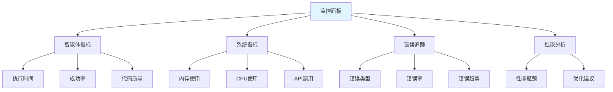

---

## 未来扩展

### 智能体生态系统

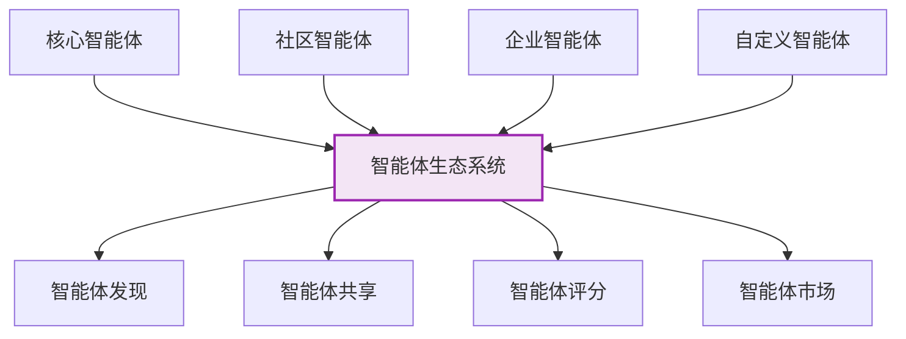

### 智能体学习网络

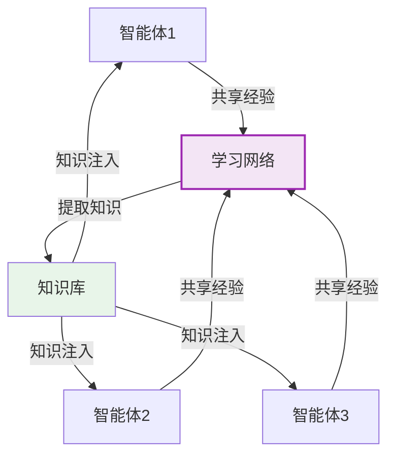

---

## 设计原则

1. **模块化设计**：每个智能体专注于特定领域，便于维护和扩展
2. **松耦合**：智能体之间通过标准化接口通信，减少依赖
3. **可观测性**：完整的监控和日志系统，便于问题定位
4. **自适应**：智能体能够从执行中学习，持续改进
5. **用户友好**：简洁的CLI界面，支持交互式和命令式操作
6. **可扩展性**：支持自定义智能体和插件，丰富生态系统

---

**文档版本**: v1.0  
**最后更新**: 2026-03-07  
**维护者**: Agently 开发团队