# Agently 技术架构设计

## 文档说明

本文档描述 Agently 项目的技术架构框图，包括整体架构、核心组件、数据流和交互关系。

---

## 整体架构概览

```mermaid
flowchart TB
    subgraph UI["用户交互层 (CLI)"]
        CLI[CLI界面模块]
        CMD[命令解析器]
        SM[会话管理器]
        IO[输入输出处理器]
        CFG[配置管理]
        
        CLI --> CMD
        CLI --> SM
        CLI --> IO
        CLI --> CFG
    end
    
    subgraph ORCH["智能体协调层 (Orchestrator)"]
        ORCH_AGENT[协调智能体]
        TASK_UND[任务理解模块]
        TASK_PLAN[任务规划器]
        AGENT_SCHED[智能体调度器]
        STATE_MGR[状态管理器]
        WORKFLOW[工作流引擎]
        
        ORCH_AGENT --> TASK_UND
        ORCH_AGENT --> TASK_PLAN
        ORCH_AGENT --> AGENT_SCHED
        ORCH_AGENT --> STATE_MGR
        ORCH_AGENT --> WORKFLOW
    end
    
    subgraph AGENTS["专业智能体层 (Agents)"]
        REQ_AGENT[需求分析智能体]
        ARCH_AGENT[架构设计智能体]
        GEN_AGENT[代码生成智能体]
        UND_AGENT[代码理解智能体]
        DEBUG_AGENT[调试修复智能体]
        TEST_AGENT[测试智能体]
        REVIEW_AGENT[代码审查智能体]
        GIT_AGENT[Git管理智能体]
        DEPLOY_AGENT[部署配置智能体]
    end
    
    subgraph CORE["核心能力层 (Core Services)"]
        CODE_REPO[代码库理解服务]
        MODEL_SVC[模型调用服务]
        TOOL_SVC[工具执行服务]
        SKILL_SYS[技能系统]
        PLUGIN_SYS[插件系统]
        OBSERV[可观测性系统]
    end
    
    subgraph INFRA["基础设施层 (Infrastructure)"]
        FS[文件系统服务]
        GIT_SVC[Git操作服务]
        TEST_SVC[测试执行服务]
        STORAGE[状态存储]
        LOGS[监控日志]
    end
    
    UI --> ORCH
    ORCH --> AGENTS
    AGENTS --> CORE
    CORE --> INFRA
    
    style UI fill:#e1f5ff
    style ORCH fill:#fff4e1
    style AGENTS fill:#e8f5e9
    style CORE fill:#f3e5f5
    style INFRA fill:#ffebee
```

---

## 用户交互层架构

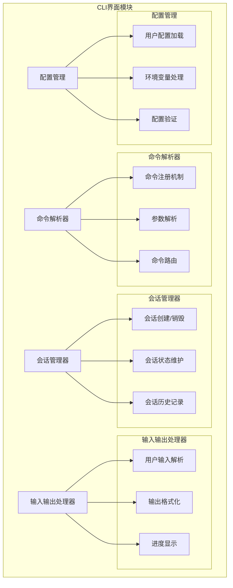

---

## 智能体协调层架构

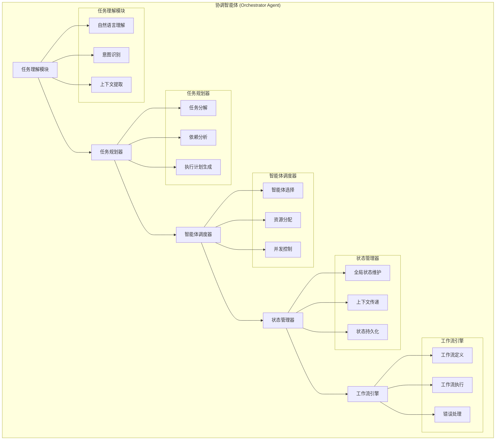

---

## SDLC智能体群架构

```mermaid
flowchart TD
    subgraph SDLC_Agents["SDLC智能体群"]
        REQ_AGENT[需求分析智能体]
        ARCH_AGENT[架构设计智能体]
        GEN_AGENT[代码生成智能体]
        UND_AGENT[代码理解智能体]
        DEBUG_AGENT[调试修复智能体]
        TEST_AGENT[测试智能体]
        REVIEW_AGENT[代码审查智能体]
        GIT_AGENT[Git管理智能体]
        DEPLOY_AGENT[部署配置智能体]
        
        subgraph REQ_Details["需求分析智能体"]
            REQ_UNDERSTAND[需求理解]
            REQ_STRUCT[需求结构化]
            RISK_ASSESS[风险评估]
        end
        
        subgraph ARCH_Details["架构设计智能体"]
            CODE_ANALYSIS[代码库分析]
            ARCH_DESIGN[架构方案设计]
            TECH_SELECT[技术选型评估]
        end
        
        subgraph GEN_Details["代码生成智能体"]
            CODE_GEN[代码生成]
            CODE_REFACTOR[代码重构]
            DOC_GEN[文档生成]
        end
        
        subgraph UND_Details["代码理解智能体"]
            CODE_ANALYSIS_2[代码分析]
            DEP_IDENTIFY[依赖关系识别]
            PATTERN_RECOG[模式识别]
        end
        
        subgraph DEBUG_Details["调试修复智能体"]
            ERROR_ANALYSIS[错误分析]
            BUG_LOCATE[Bug定位]
            FIX_GEN[修复方案生成]
        end
        
        subgraph TEST_Details["测试智能体"]
            TEST_GEN[测试生成]
            TEST_EXEC[测试执行]
            COVERAGE_ANALYSIS[覆盖率分析]
        end
        
        subgraph REVIEW_Details["代码审查智能体"]
            QUALITY_CHECK[质量检查]
            SECURITY_CHECK[安全检查]
            IMPROVE_SUGGEST[改进建议]
        end
        
        subgraph GIT_Details["Git管理智能体"]
            BRANCH_MGR[分支管理]
            COMMIT_MGR[提交管理]
            PR_MGR[PR管理]
        end
        
        subgraph DEPLOY_Details["部署配置智能体"]
            CONFIG_GEN[配置生成]
            CICD_DESIGN[CI/CD设计]
            ENV_MGR[环境管理]
        end
        
        REQ_AGENT --> REQ_UNDERSTAND
        REQ_AGENT --> REQ_STRUCT
        REQ_AGENT --> RISK_ASSESS
        
        ARCH_AGENT --> CODE_ANALYSIS
        ARCH_AGENT --> ARCH_DESIGN
        ARCH_AGENT --> TECH_SELECT
        
        GEN_AGENT --> CODE_GEN
        GEN_AGENT --> CODE_REFACTOR
        GEN_AGENT --> DOC_GEN
        
        UND_AGENT --> CODE_ANALYSIS_2
        UND_AGENT --> DEP_IDENTIFY
        UND_AGENT --> PATTERN_RECOG
        
        DEBUG_AGENT --> ERROR_ANALYSIS
        DEBUG_AGENT --> BUG_LOCATE
        DEBUG_AGENT --> FIX_GEN
        
        TEST_AGENT --> TEST_GEN
        TEST_AGENT --> TEST_EXEC
        TEST_AGENT --> COVERAGE_ANALYSIS
        
        REVIEW_AGENT --> QUALITY_CHECK
        REVIEW_AGENT --> SECURITY_CHECK
        REVIEW_AGENT --> IMPROVE_SUGGEST
        
        GIT_AGENT --> BRANCH_MGR
        GIT_AGENT --> COMMIT_MGR
        GIT_AGENT --> PR_MGR
        
        DEPLOY_AGENT --> CONFIG_GEN
        DEPLOY_AGENT --> CICD_DESIGN
        DEPLOY_AGENT --> ENV_MGR
    end
```

---

## 核心能力层架构

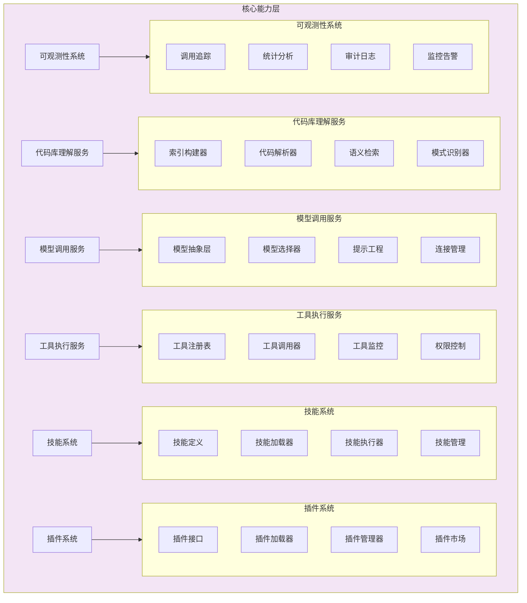

---

## 代码库理解服务详细架构

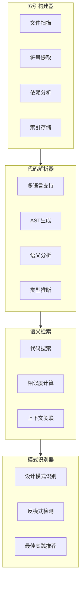

---

## 模型调用服务详细架构

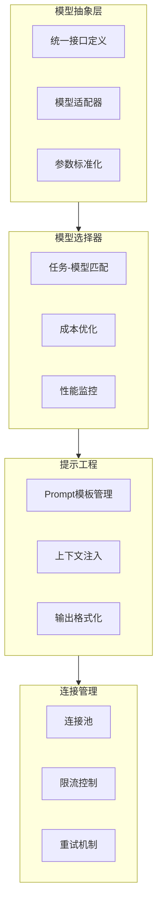

---

## 基础设施层架构

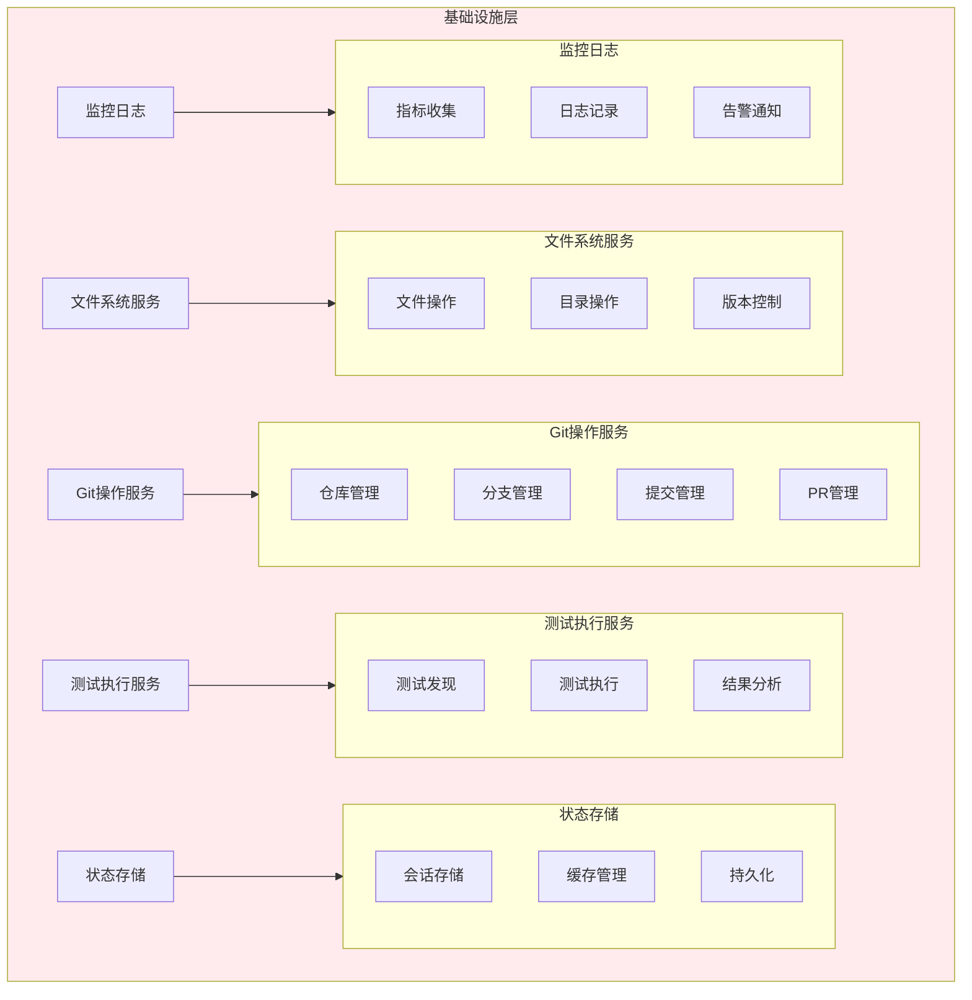

---

## 用户请求处理流程

```mermaid
flowchart LR
    User[用户输入] --> CLI[CLI界面]
    CLI --> CMD_PARSE[命令解析]
    CMD_PARSE --> ORCH_AGENT[协调智能体]
    
    ORCH_AGENT --> TASK_UND[任务理解]
    TASK_UND --> TASK_PLAN[任务规划]
    TASK_PLAN --> AGENT_SCHED[智能体调度]
    
    AGENT_SCHED --> AGENT1[专业智能体执行]
    AGENT1 --> CORE_SVC[核心能力调用]
    CORE_SVC --> INFRA[基础设施操作]
    
    INFRA --> RESULT_COLLECT[结果收集]
    RESULT_COLLECT --> STATE_UPDATE[状态更新]
    STATE_UPDATE --> OUTPUT_FMT[输出格式化]
    OUTPUT_FMT --> USER_SHOW[用户展示]
    
    style User fill:#e1f5ff
    style USER_SHOW fill:#c8e6c9
```

---

## 智能体协作流程

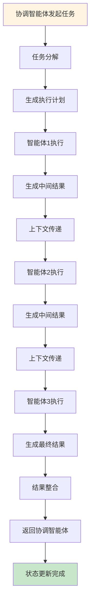

---

## 可观测性数据流

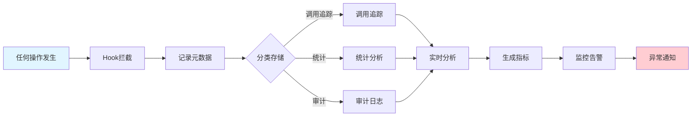

---

## 多智能体协作序列图

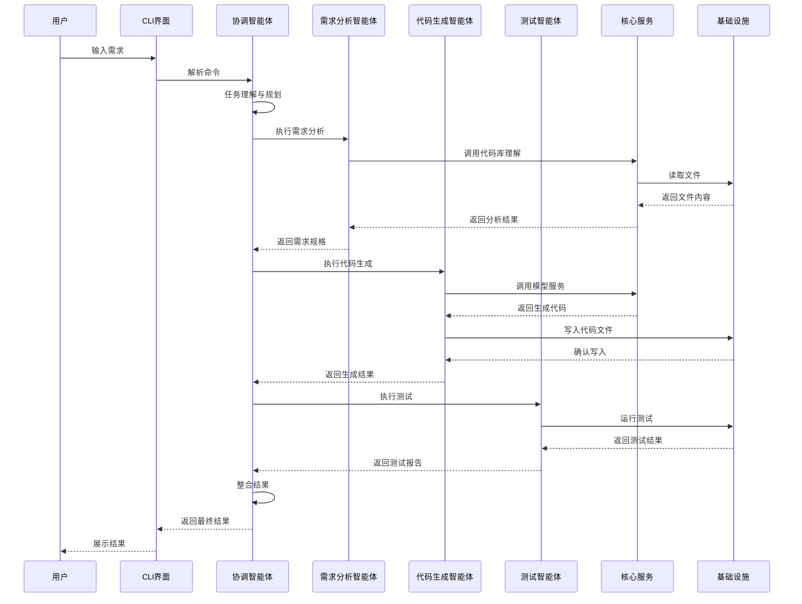

---

## 技能系统工作流程

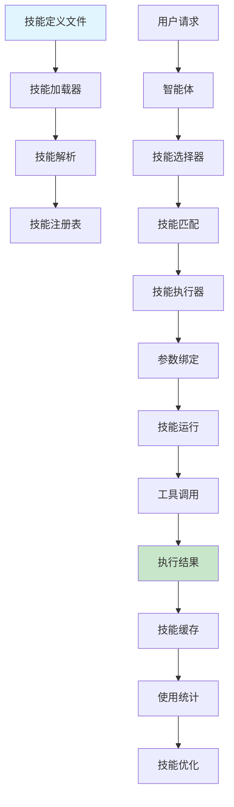

---

## 插件系统架构

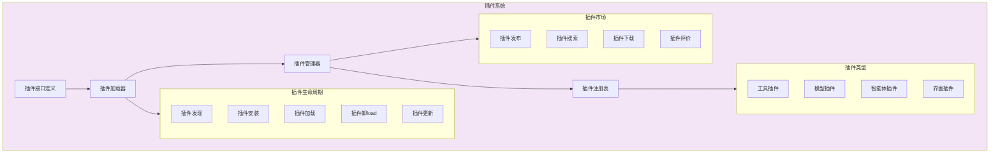

---

## 系统状态管理架构

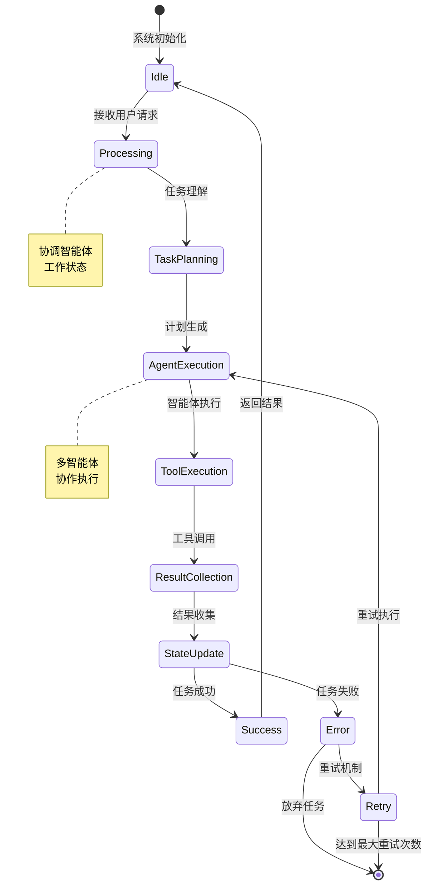

---

## 扩展点设计

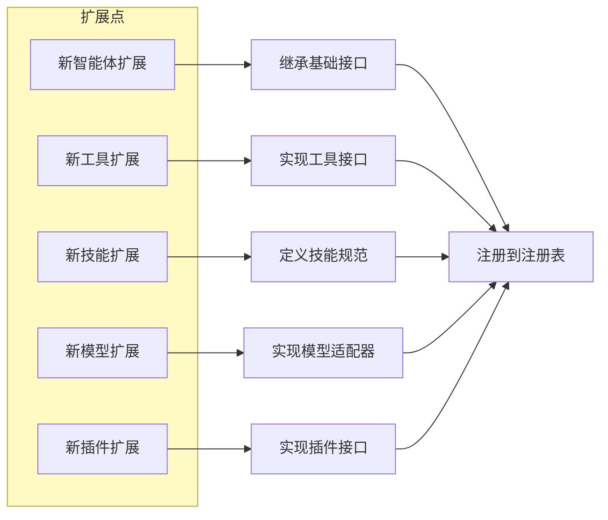

---

## 数据存储架构

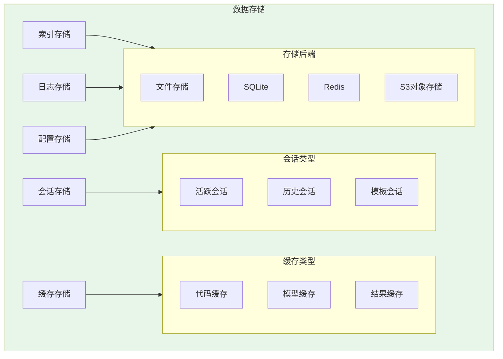

---

## 性能优化架构

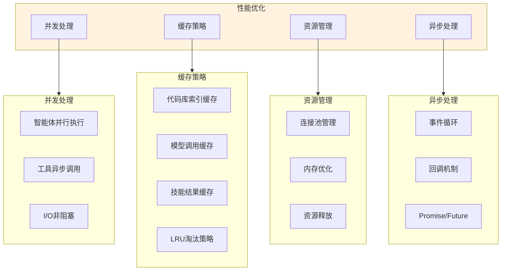

---

## 安全架构

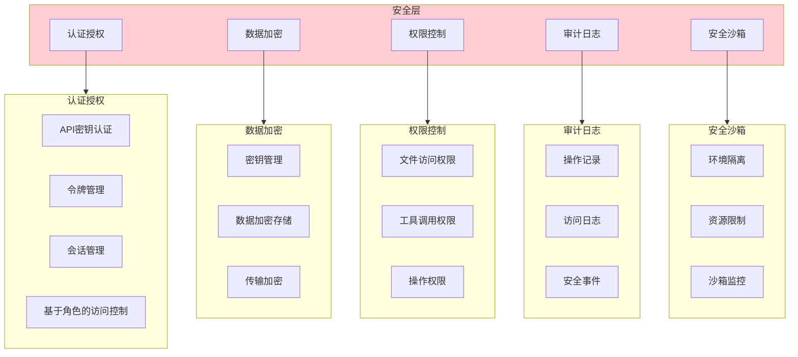

---

## 架构演进路线

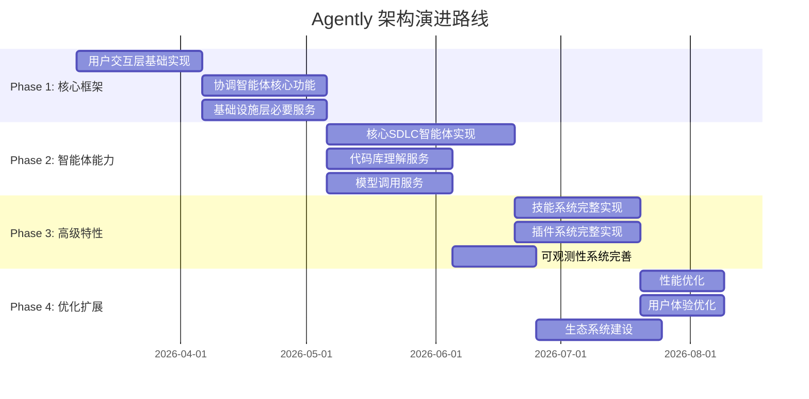

---

## 关键设计模式

```mermaid
flowchart TB
    subgraph Patterns["关键设计模式"]
        LAYERED[分层架构模式]
        PLUGIN[插件模式]
        OBSERVER[观察者模式]
        STRATEGY[策略模式]
        CHAIN[责任链模式]
        FACTORY[工厂模式]
        BUILDER[建造者模式]
        SINGLETON[单例模式]
    end
    
    LAYERED --> DESCRIPTION1["清晰的职责分离<br/>每层只依赖下层<br/>便于独立开发测试"]
    PLUGIN --> DESCRIPTION2["标准化的扩展接口<br/>动态加载和卸载<br/>低耦合的扩展机制"]
    OBSERVER --> DESCRIPTION3["可观测性基于事件驱动<br/>松耦合的监控机制<br/>实时的事件处理"]
    STRATEGY --> DESCRIPTION4["模型选择策略<br/>工具调用策略<br/>技能选择策略"]
    CHAIN --> DESCRIPTION5["智能体协作链<br/>工具调用链<br/>错误处理链"]
    
    style Patterns fill:#e1f5ff
```

---

**文档版本**: v1.1  
**最后更新**: 2026-03-07  
**维护者**: Agently 开发团队