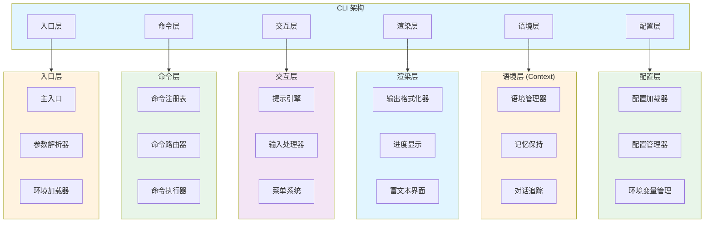
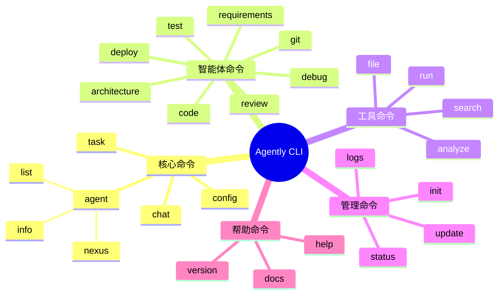
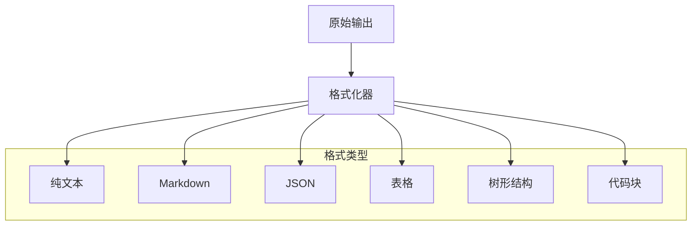
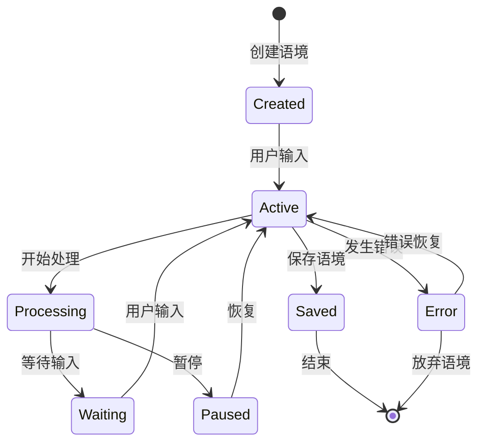
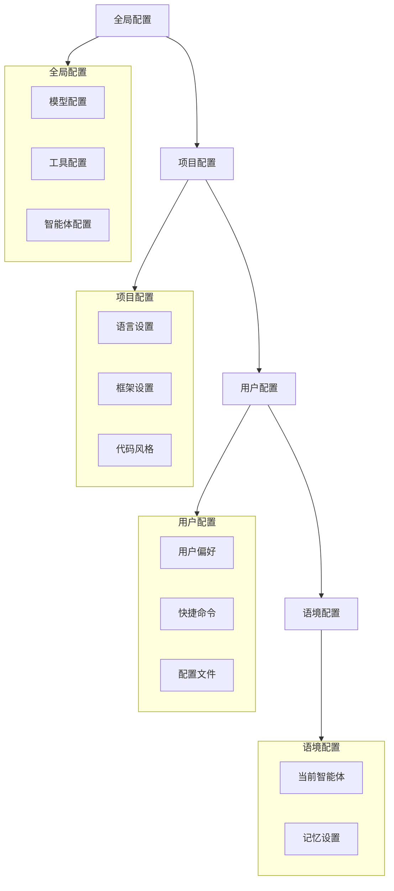
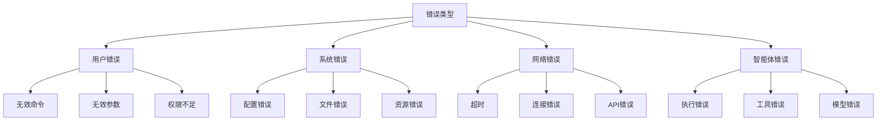
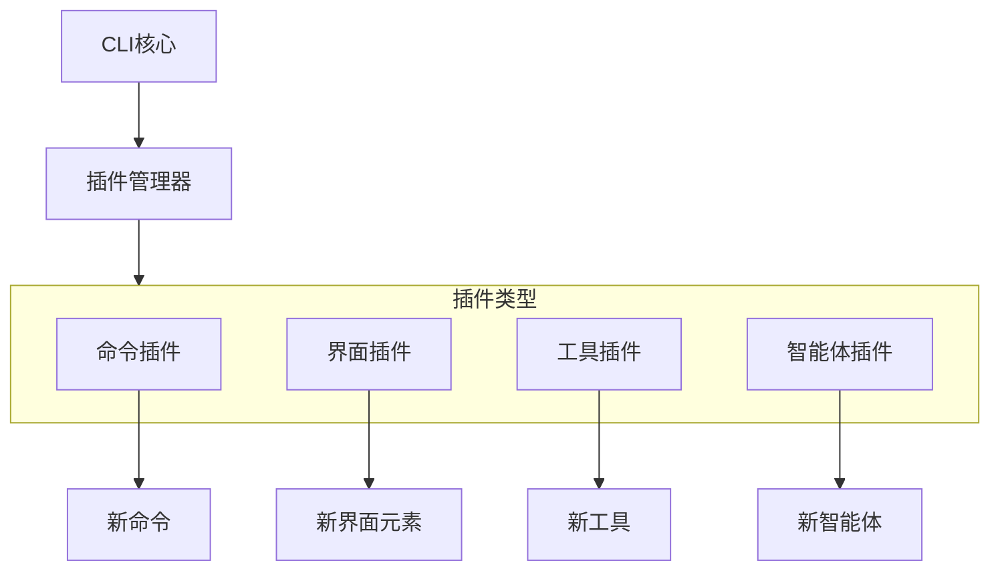

# Agently CLI 架构设计

## 文档说明

本文档详细描述 Agently CLI 的架构设计，包括命令结构、交互模式、界面组件等。

---

## CLI 架构概览



---

## 命令结构设计

### 命令层次

```
agently [全局选项] <命令> [子命令] [参数] [选项]
```

### 命令分类



### 命令详细设计

#### 1. 核心命令

| 命令 | 子命令 | 描述 | 示例 |
|------|--------|------|------|
| `agent` | - | 智能体管理 | `agently agent` |
| | `nexus` | 使用 Nexus 综合智能体 | `agently agent nexus` |
| | `[name]` | 使用特定智能体 | `agently agent code-generator` |
| | `list` | 列出所有智能体 | `agently agent list` |
| | `info [name]` | 查看智能体信息 | `agently agent info nexus` |
| `chat` | - | 交互式对话模式 | `agently chat` |
| `task` | - | 执行特定任务 | `agently task "修复登录bug"` |
| `config` | - | 配置管理 | `agently config` |

#### 2. 智能体快捷命令

| 命令 | 描述 | 示例 |
|------|------|------|
| `requirements` | 需求分析 | `agently requirements "用户认证功能"` |
| `architecture` | 架构设计 | `agently architecture "设计API网关"` |
| `code` | 代码生成 | `agently code "生成用户模型"` |
| `debug` | 调试修复 | `agently debug "分析错误日志"` |
| `test` | 测试生成 | `agently test "生成单元测试"` |
| `review` | 代码审查 | `agently review src/main.py` |
| `git` | Git 操作 | `agently git "提交当前更改"` |
| `deploy` | 部署配置 | `agently deploy "配置Docker"` |

#### 3. 工具命令

| 命令 | 子命令 | 描述 | 示例 |
|------|--------|------|------|
| `file` | `read` | 读取文件 | `agently file read src/main.py` |
| | `write` | 写入文件 | `agently file write output.txt "内容"` |
| | `search` | 搜索文件 | `agently file search "*.py"` |
| `search` | - | 代码搜索 | `agently search "class User"` |
| `analyze` | - | 代码分析 | `agently analyze src/` |
| `run` | - | 运行命令 | `agently run "npm test"` |

#### 4. 管理命令

| 命令 | 描述 | 示例 |
|------|------|------|
| `init` | 初始化项目 | `agently init` |
| `status` | 查看状态 | `agently status` |
| `logs` | 查看日志 | `agently logs` |
| `update` | 更新系统 | `agently update` |

---

## 交互模式设计

### 1. 命令行模式

```bash
# 直接执行命令
$ agently agent nexus "帮我开发一个用户认证系统"

# 使用特定智能体
$ agently code "生成一个Python类来处理用户数据"

# 批量处理
$ agently task --file tasks.txt
```

### 2. 交互式模式

```bash
$ agently chat

Agently v1.0.0 - 智能编程助手
================================

当前智能体: Nexus (综合智能体)
工作目录: /Users/dev/myproject

> 帮我分析这个项目的架构

[思考中...]

正在分析项目架构...
✓ 扫描项目结构
✓ 分析依赖关系
✓ 识别核心模块

项目架构分析结果:
- 项目类型: Python Web 应用
- 框架: FastAPI
- 主要模块: api, models, services, utils
- 建议: 可以考虑将 services 模块进一步拆分

> 切换到代码生成智能体

已切换到: code-generator (代码生成智能体)

> 生成一个用户认证中间件

[生成中...]

✓ 已生成: src/middleware/auth.py
✓ 已生成: src/models/user.py
✓ 已更新: src/main.py

> exit

再见！语境已保存。
```

### 3. 菜单模式

```bash
$ agently

Agently - 智能编程助手
======================

请选择操作:

1. 🚀 快速开始 (使用 Nexus 智能体)
2. 🤖 选择智能体
3. 💬 交互式对话
4. 📁 项目管理
5. ⚙️  配置设置
6. ❓ 帮助文档
7. 🚪 退出

请输入选项 [1-7]: 2

选择智能体:

1. Nexus - 综合智能体 (推荐)
2. requirements-analyzer - 需求分析
3. architecture-designer - 架构设计
4. code-generator - 代码生成
5. code-understander - 代码理解
6. bug-fixer - 调试修复
7. tester - 测试
8. code-reviewer - 代码审查
9. git-manager - Git管理
10. deploy-configurator - 部署配置

请输入智能体编号 [1-10]: 1

已选择: Nexus (综合智能体)

请输入您的需求:
```

---

## 界面组件设计

### 1. 输出格式化



### 2. 进度显示

```
[分析中...] 扫描项目结构 ████████░░ 80%
[生成中...] 生成代码文件 ██████░░░░ 60%
[测试中...] 运行测试用例 ██████████ 100% ✓
```

### 3. 富文本界面元素

```
┌─────────────────────────────────────────┐
│  Agently - 智能编程助手                  │
├─────────────────────────────────────────┤
│  当前智能体: Nexus                       │
│  工作目录: /Users/dev/project           │
│  语境时长: 15分钟                        │
├─────────────────────────────────────────┤
│  最近操作:                              │
│  ✓ 分析项目架构                         │
│  ✓ 生成用户模型                         │
│  ✓ 创建API端点                          │
│  ⏳ 生成测试用例                         │
└─────────────────────────────────────────┘
```

---

## 语境管理设计

### 语境生命周期



### 语境数据结构

```yaml
context:
  id: "sess_20260307_001"
  created_at: "2026-03-07T10:00:00Z"
  updated_at: "2026-03-07T10:30:00Z"
  
  context:
    working_directory: "/Users/dev/project"
    current_agent: "nexus"
    conversation_history:
      - role: "user"
        content: "帮我开发用户认证系统"
        timestamp: "2026-03-07T10:00:00Z"
      - role: "assistant"
        content: "我来帮您开发用户认证系统..."
        timestamp: "2026-03-07T10:00:05Z"
    
    task_state:
      current_task: "开发用户认证系统"
      subtasks:
        - id: 1
          description: "分析需求"
          status: "completed"
        - id: 2
          description: "设计架构"
          status: "completed"
        - id: 3
          description: "生成代码"
          status: "in_progress"
    
    file_context:
      modified_files:
        - "src/models/user.py"
        - "src/auth/middleware.py"
      created_files:
        - "src/auth/__init__.py"
```

---

## 配置管理设计

### 配置层次结构



### 配置文件示例

```yaml
# ~/.agently/config.yaml
version: "1.0"

# 全局设置
global:
  default_agent: "nexus"
  output_format: "markdown"
  auto_save: true
  verbose: false

# 模型配置
models:
  default: "openai"
  providers:
    openai:
      api_key: "${OPENAI_API_KEY}"
      model: "gpt-4"
      temperature: 0.7
    anthropic:
      api_key: "${ANTHROPIC_API_KEY}"
      model: "claude-3-opus-20240229"
      temperature: 0.7

# 智能体配置
agents:
  nexus:
    model: "openai"
    max_workers: 5
    timeout: 600
  code-generator:
    model: "anthropic"
    code_style: "pep8"

# 用户偏好
user:
  theme: "dark"
  language: "zh-CN"
  shortcuts:
    - name: "快速生成"
      command: "agently code"
      alias: "gen"
```

---

## 错误处理设计

### 错误分类



### 错误处理流程

```
错误发生
    ↓
错误分类
    ↓
错误记录
    ↓
用户提示
    ↓
恢复策略
    ↓
继续/退出
```

---

## 扩展机制设计

### 插件系统



### 自定义命令示例

```python
from agently.cli import Command, register_command

class MyCustomCommand(Command):
    name = "my-cmd"
    description = "我的自定义命令"
    
    def execute(self, args):
        # 实现命令逻辑
        pass

register_command(MyCustomCommand())
```

---

## Agently CLI 核心设计原则

### 1. 多智能体协作支持

Agently CLI 设计为支持多智能体协作的编程助手：

- **Nexus 综合智能体**：默认使用 Nexus 自动调度多个专业智能体
- **专业智能体快捷命令**：直接调用特定领域的专业智能体
- **智能体切换**：支持在交互过程中动态切换智能体
- **协作可视化**：展示多智能体协作的执行过程

### 2. 三种交互模式

| 模式 | 适用场景 | 特点 |
|------|----------|------|
| **命令行模式** | 快速执行、脚本集成 | 简洁高效，支持管道操作 |
| **交互式模式** | 复杂任务、探索性开发 | 自然语言对话，上下文保持 |
| **菜单模式** | 新手引导、功能发现 | 可视化菜单，逐步引导 |

### 3. 语境感知设计

- **自动识别工作目录**：启动时自动识别代码库上下文
- **语境保持**：对话历史和任务状态在语境间保持
- **智能补全**：基于代码库和语境的智能命令补全
- **项目配置**：支持项目级别的配置覆盖

### 4. 完整的 SDLC 支持

CLI 设计覆盖软件开发生命周期的各个阶段：

- **需求分析**：`agently requirements`
- **架构设计**：`agently architecture`
- **代码开发**：`agently code`
- **调试修复**：`agently debug`
- **测试验证**：`agently test`
- **代码审查**：`agently review`
- **版本控制**：`agently git`
- **部署发布**：`agently deploy`

### 5. 可观测性集成

- **执行监控**：实时显示任务执行进度
- **性能统计**：记录和展示性能指标
- **日志追踪**：完整的操作日志记录
- **错误诊断**：详细的错误信息和修复建议

---

## 实现建议

### 推荐的 CLI 框架

1. **Click**：成熟的 Python CLI 框架，功能丰富
2. **Typer**：基于 Click，支持类型提示，现代化
3. **Rich**：富文本渲染，支持表格、进度条、Markdown
4. **Prompt Toolkit**：交互式输入，支持自动补全
5. **Inquirer**：交互式菜单，支持选择、确认等

### 推荐的组合

- **Typer** + **Rich** + **Prompt Toolkit**
  - Typer：命令定义和参数解析
  - Rich：富文本输出和界面渲染
  - Prompt Toolkit：交互式输入和语境管理

---

**文档版本**: v1.0  
**最后更新**: 2026-03-07  
**维护者**: Agently 开发团队