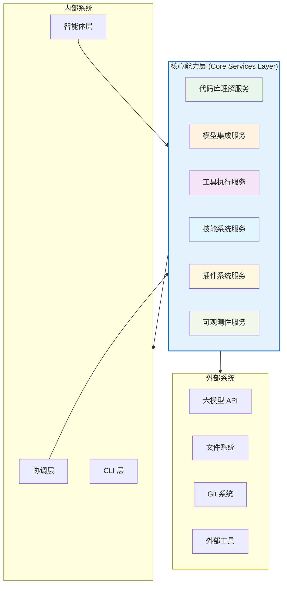
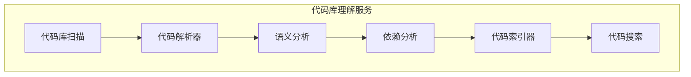
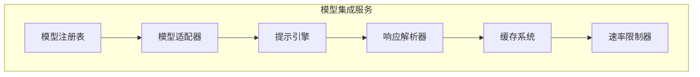
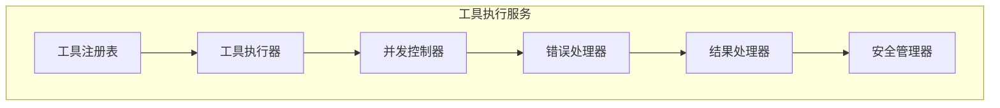
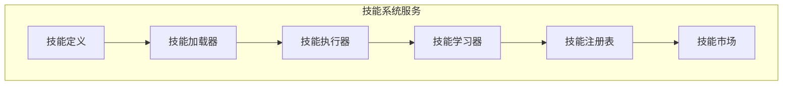
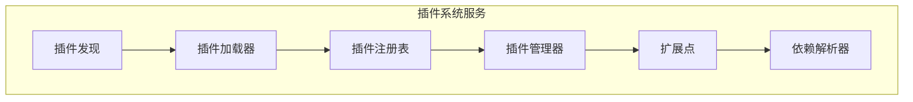
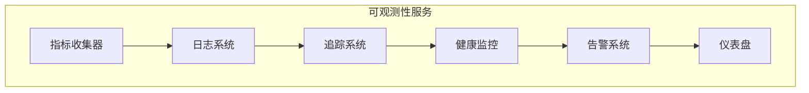
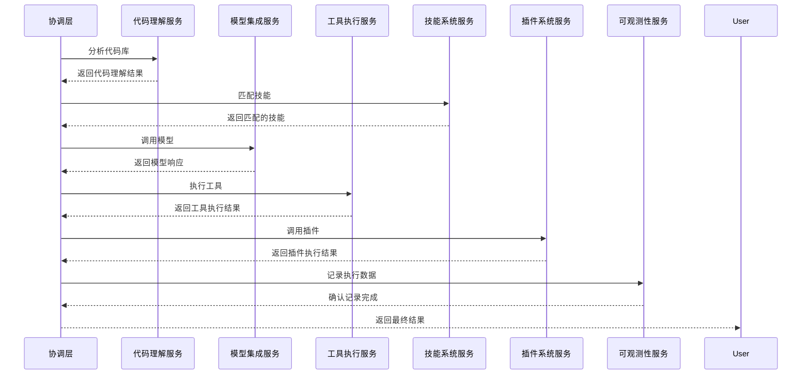

# Agently 核心能力层架构设计

## 文档说明

本文档详细描述 Agently 核心能力层的架构设计，包括代码库理解、模型调用、工具执行、技能系统、插件系统和可观测性等核心服务。

---

## 核心能力层架构概览



---

## 1. 代码库理解服务

### 1.1 核心功能



### 1.2 技术实现

#### 代码库扫描
- **文件系统遍历**：递归扫描项目文件
- **语言识别**：自动识别代码语言和框架
- **结构分析**：构建项目结构树
- **元数据提取**：提取文件元数据（修改时间、大小等）

#### 代码解析
- **语法解析**：使用语言特定的解析器
- **抽象语法树 (AST)**：构建代码的语法结构
- **符号表**：提取变量、函数、类等符号
- **类型分析**：推断变量和函数的类型

#### 语义分析
- **代码意图理解**：理解代码的功能和目的
- **上下文分析**：分析代码的上下文关系
- **模式识别**：识别常见的代码模式和设计模式
- **代码质量分析**：检测潜在的问题和优化机会

#### 依赖分析
- **依赖图构建**：构建模块间的依赖关系图
- **循环依赖检测**：检测循环依赖问题
- **依赖版本分析**：分析依赖的版本兼容性
- **影响分析**：分析代码变更的影响范围

#### 代码索引
- **全文索引**：构建代码的全文搜索索引
- **符号索引**：构建符号的快速查找索引
- **语义索引**：构建基于语义的索引
- **增量更新**：支持增量索引更新

#### 代码搜索
- **精确搜索**：精确匹配代码片段
- **模糊搜索**：支持模糊匹配和近似搜索
- **语义搜索**：基于语义理解的搜索
- **上下文搜索**：搜索代码的上下文信息

### 1.3 业界最佳实践参考

| 工具 | 核心能力 | 参考价值 |
|------|----------|----------|
| **Cursor** | 实时代码理解、智能补全 | 实时分析和理解代码的能力 |
| **Trae** | 项目级理解、代码导航 | 整体项目结构的理解能力 |
| **OpenCode** | 代码上下文感知 | 上下文相关的代码理解 |
| **Claude Code** | 长上下文理解 | 处理长代码文件的能力 |

---

## 2. 模型集成服务

### 2.1 核心功能



### 2.2 技术实现

#### 模型注册表
- **模型管理**：管理不同的模型提供商和模型
- **配置管理**：管理模型的配置参数
- **认证管理**：管理模型的认证信息
- **模型版本**：支持模型版本管理

#### 模型适配器
- **统一接口**：为不同模型提供统一的接口
- **参数映射**：映射不同模型的参数
- **错误处理**：统一处理不同模型的错误
- **重试机制**：实现模型调用的重试逻辑

#### 提示引擎
- **提示模板**：管理和应用提示模板
- **提示优化**：优化提示以获得更好的结果
- **上下文管理**：管理提示的上下文信息
- **多模态支持**：支持文本、代码、图像等多模态提示

#### 响应解析器
- **结构化解析**：解析模型响应为结构化数据
- **错误检测**：检测和处理模型响应中的错误
- **结果验证**：验证模型响应的正确性
- **格式转换**：将模型响应转换为所需格式

#### 缓存系统
- **响应缓存**：缓存模型响应以提高性能
- **提示缓存**：缓存常用的提示模板
- **缓存策略**：实现智能缓存策略
- **缓存失效**：管理缓存的失效机制

#### 速率限制器
- **API 速率控制**：控制 API 调用频率
- **配额管理**：管理 API 配额使用
- **优先级队列**：实现请求优先级管理
- **节流策略**：实现智能节流策略

### 2.3 业界最佳实践参考

| 工具 | 核心能力 | 参考价值 |
|------|----------|----------|
| **OpenAI API** | 统一的模型接口 | 标准化的模型调用方式 |
| **Claude API** | 长上下文处理 | 处理大型代码文件的能力 |
| **Gemini API** | 多模态支持 | 代码和图像的结合处理 |
| **Cursor** | 模型选择优化 | 根据任务选择合适的模型 |

---

## 3. 工具执行服务

### 3.1 核心功能



### 3.2 技术实现

#### 工具注册表
- **工具管理**：管理可用的工具和功能
- **元数据管理**：管理工具的元数据和参数
- **版本控制**：支持工具版本管理
- **依赖管理**：管理工具的依赖关系

#### 工具执行器
- **同步执行**：支持同步执行工具
- **异步执行**：支持异步执行工具
- **执行环境**：管理工具的执行环境
- **资源管理**：管理工具执行的资源使用

#### 并发控制器
- **线程池管理**：管理执行线程池
- **并发限制**：控制并发执行的数量
- **死锁检测**：检测和处理死锁情况
- **资源分配**：智能分配系统资源

#### 错误处理器
- **错误分类**：分类和处理不同类型的错误
- **重试机制**：实现智能重试策略
- **回退策略**：实现错误回退策略
- **错误报告**：生成详细的错误报告

#### 结果处理器
- **结果解析**：解析工具执行的结果
- **结果转换**：转换结果为标准格式
- **结果验证**：验证结果的正确性
- **结果缓存**：缓存工具执行结果

#### 安全管理器
- **权限控制**：控制工具的访问权限
- **安全检查**：检查工具执行的安全性
- **隔离执行**：实现工具的隔离执行
- **审计日志**：记录工具执行的审计日志

### 3.3 业界最佳实践参考

| 工具 | 核心能力 | 参考价值 |
|------|----------|----------|
| **OpenCode** | 工具集成框架 | 统一的工具管理和执行 |
| **Trae** | 系统命令执行 | 安全执行系统命令的能力 |
| **Cursor** | 编辑器集成 | 与编辑器的无缝集成 |
| **GitHub Copilot** | 代码生成工具 | 智能代码生成能力 |

---

## 4. 技能系统服务

### 4.1 核心功能



### 4.2 技术实现

#### 技能定义
- **技能格式**：定义技能的标准格式（SKILL.md）
- **技能结构**：定义技能的结构和组成部分
- **技能参数**：定义技能的输入参数
- **技能输出**：定义技能的输出格式

#### 技能加载器
- **文件解析**：解析 SKILL.md 文件
- **依赖解析**：解析技能的依赖关系
- **验证机制**：验证技能定义的有效性
- **缓存机制**：缓存加载的技能

#### 技能执行器
- **执行流程**：管理技能的执行流程
- **参数传递**：处理技能的输入参数
- **上下文管理**：管理技能执行的上下文
- **结果处理**：处理技能执行的结果

#### 技能学习器
- **执行分析**：分析技能执行的结果
- **性能评估**：评估技能的执行性能
- **自动优化**：自动优化技能的执行
- **知识提取**：从执行中提取知识

#### 技能注册表
- **技能管理**：管理已注册的技能
- **分类管理**：对技能进行分类管理
- **搜索功能**：支持技能的搜索和发现
- **版本管理**：管理技能的版本

#### 技能市场
- **技能分享**：支持技能的分享和发布
- **社区贡献**：支持社区贡献技能
- **技能评价**：支持技能的评价和反馈
- **技能推荐**：基于使用情况推荐技能

### 4.3 业界最佳实践参考

| 工具 | 核心能力 | 参考价值 |
|------|----------|----------|
| **OpenCode Skills** | 技能标准 | 标准化的技能定义和执行 |
| **Anthropic Agent Skills** | 开放标准 | 开放的技能生态系统 |
| **Cursor Commands** | 命令系统 | 简洁的命令式技能 |
| **GitHub Actions** | 工作流定义 | 声明式的工作流定义 |

---

## 5. 插件系统服务

### 5.1 核心功能



### 5.2 技术实现

#### 插件发现
- **自动发现**：自动发现系统中的插件
- **手动安装**：支持手动安装插件
- **远程仓库**：从远程仓库获取插件
- **版本检查**：检查插件的版本更新

#### 插件加载器
- **动态加载**：动态加载插件代码
- **依赖检查**：检查插件的依赖关系
- **兼容性检查**：检查插件的兼容性
- **安全检查**：检查插件的安全性

#### 插件注册表
- **插件信息**：存储插件的元信息
- **状态管理**：管理插件的启用/禁用状态
- **版本管理**：管理插件的版本信息
- **依赖管理**：管理插件的依赖关系

#### 插件管理器
- **生命周期管理**：管理插件的生命周期
- **配置管理**：管理插件的配置
- **事件系统**：提供插件事件系统
- **API 管理**：管理插件 API 的访问

#### 扩展点
- **核心扩展点**：定义核心系统的扩展点
- **扩展点注册**：允许插件注册到扩展点
- **扩展点调用**：在适当的时候调用扩展点
- **扩展点优先级**：管理扩展点的调用优先级

#### 依赖解析器
- **依赖分析**：分析插件的依赖关系
- **依赖冲突**：检测和解决依赖冲突
- **依赖安装**：自动安装缺失的依赖
- **依赖版本**：管理依赖的版本兼容性

### 5.3 业界最佳实践参考

| 工具 | 核心能力 | 参考价值 |
|------|----------|----------|
| **VS Code Extensions** | 插件生态 | 成熟的插件系统架构 |
| **OpenCode Plugins** | 扩展机制 | 灵活的扩展点设计 |
| **Cursor Extensions** | 编辑器集成 | 与编辑器的深度集成 |
| **Trae Plugins** | 功能扩展 | 模块化的功能扩展 |

---

## 6. 可观测性服务

### 6.1 核心功能



### 6.2 技术实现

#### 指标收集器
- **性能指标**：收集系统性能指标
- **业务指标**：收集业务相关指标
- **资源指标**：收集系统资源使用指标
- **自定义指标**：支持自定义指标收集

#### 日志系统
- **结构化日志**：生成结构化的日志
- **日志级别**：支持不同级别的日志
- **日志聚合**：聚合和分析日志
- **日志查询**：支持日志的查询和检索

#### 追踪系统
- **分布式追踪**：实现分布式系统的追踪
- **调用链**：跟踪请求的完整调用链
- **性能分析**：分析系统性能瓶颈
- **依赖分析**：分析系统组件的依赖关系

#### 健康监控
- **系统健康**：监控系统的健康状态
- **组件健康**：监控各个组件的健康状态
- **服务健康**：监控服务的可用性
- **资源健康**：监控资源的使用情况

#### 告警系统
- **告警规则**：定义告警规则和阈值
- **告警通知**：发送告警通知
- **告警聚合**：聚合相关的告警
- **告警升级**：实现告警的升级机制

#### 仪表盘
- **实时监控**：实时显示系统状态
- **历史趋势**：显示指标的历史趋势
- **自定义视图**：支持自定义仪表盘视图
- **导出功能**：支持导出监控数据

### 6.3 业界最佳实践参考

| 工具 | 核心能力 | 参考价值 |
|------|----------|----------|
| **OpenTelemetry** | 可观测性标准 | 统一的可观测性框架 |
| **Prometheus** | 指标监控 | 强大的指标收集和分析 |
| **ELK Stack** | 日志分析 | 完整的日志处理方案 |
| **Jaeger** | 分布式追踪 | 专业的分布式追踪系统 |

---

## 核心服务数据流

### 典型工作流程



---

## 核心服务 API 设计

### 代码理解服务 API

```python
class CodeUnderstandingService:
    def analyze_repository(self, repo_path: str) -> RepositoryAnalysis:
        """分析代码仓库"""
        pass
    
    def parse_code(self, file_path: str) -> CodeAnalysis:
        """解析代码文件"""
        pass
    
    def search_code(self, query: str, repo_path: str) -> List[CodeMatch]:
        """搜索代码"""
        pass
    
    def analyze_dependencies(self, repo_path: str) -> DependencyGraph:
        """分析依赖关系"""
        pass
```

### 模型集成服务 API

```python
class ModelIntegrationService:
    def call_model(self, model_name: str, prompt: str, **kwargs) -> ModelResponse:
        """调用模型"""
        pass
    
    def get_available_models(self) -> List[ModelInfo]:
        """获取可用模型"""
        pass
    
    def optimize_prompt(self, prompt: str, task_type: str) -> str:
        """优化提示词"""
        pass
```

### 工具执行服务 API

```python
class ToolExecutionService:
    def execute_tool(self, tool_name: str, **params) -> ToolResult:
        """执行工具"""
        pass
    
    def get_available_tools(self) -> List[ToolInfo]:
        """获取可用工具"""
        pass
    
    def register_tool(self, tool: Tool) -> bool:
        """注册工具"""
        pass
```

### 技能系统服务 API

```python
class SkillSystemService:
    def execute_skill(self, skill_name: str, **params) -> SkillResult:
        """执行技能"""
        pass
    
    def get_available_skills(self) -> List[SkillInfo]:
        """获取可用技能"""
        pass
    
    def load_skill(self, skill_path: str) -> Skill:
        """加载技能"""
        pass
```

### 插件系统服务 API

```python
class PluginSystemService:
    def load_plugin(self, plugin_path: str) -> Plugin:
        """加载插件"""
        pass
    
    def get_available_plugins(self) -> List[PluginInfo]:
        """获取可用插件"""
        pass
    
    def enable_plugin(self, plugin_name: str) -> bool:
        """启用插件"""
        pass
```

### 可观测性服务 API

```python
class ObservabilityService:
    def record_metric(self, name: str, value: float, **tags) -> None:
        """记录指标"""
        pass
    
    def log(self, level: str, message: str, **context) -> None:
        """记录日志"""
        pass
    
    def start_trace(self, name: str) -> Trace:
        """开始追踪"""
        pass
```

---

## 实施路线图

### Phase 1: 基础服务
- 实现代码库扫描和解析
- 实现基本的模型调用
- 实现核心工具执行
- 实现基础的日志和指标

### Phase 2: 核心功能
- 实现语义代码分析
- 实现多模型集成
- 实现技能系统基础
- 实现插件系统框架
- 实现完整的可观测性

### Phase 3: 高级功能
- 实现代码依赖分析
- 实现智能提示优化
- 实现技能学习和优化
- 实现插件生态系统
- 实现高级监控和告警

### Phase 4: 优化和扩展
- 性能优化和缓存
- 安全性增强
- 扩展性改进
- 社区生态建设

---

## 核心特性对比

| 特性 | 传统编程工具 | Agently 核心能力 |
|------|--------------|------------------|
| **代码理解** | 语法高亮 | 语义理解 + 依赖分析 |
| **模型集成** | 单一模型 | 多模型集成 + 智能选择 |
| **工具执行** | 手动操作 | 自动化执行 + 错误处理 |
| **技能系统** | 无 | 可复用技能 + 自动学习 |
| **插件系统** | 静态扩展 | 动态扩展 + 依赖管理 |
| **可观测性** | 基本日志 | 全维度监控 + 智能告警 |

---

## 总结

Agently 核心能力层设计实现了：

1. **代码库理解**：深入理解代码结构和语义
2. **模型集成**：智能管理和调用多个大模型
3. **工具执行**：安全、高效地执行各种工具
4. **技能系统**：实现可复用的开发技能
5. **插件系统**：支持系统功能的扩展
6. **可观测性**：全面监控系统运行状态

这些核心能力使 Agently 能够提供智能、高效、可靠的编程助手服务，为开发者提供全方位的 AI 辅助。

---

**文档版本**: v1.0  
**最后更新**: 2026-03-07  
**维护者**: Agently 开发团队