# Agently 部署架构设计

## 文档说明

本文档描述 Agently 项目的部署架构设计，包括分发策略、CI/CD 流程、版本管理和发布流程。基于项目的技术架构和业界 CLI 工具的最佳实践。

---

## 部署架构概览

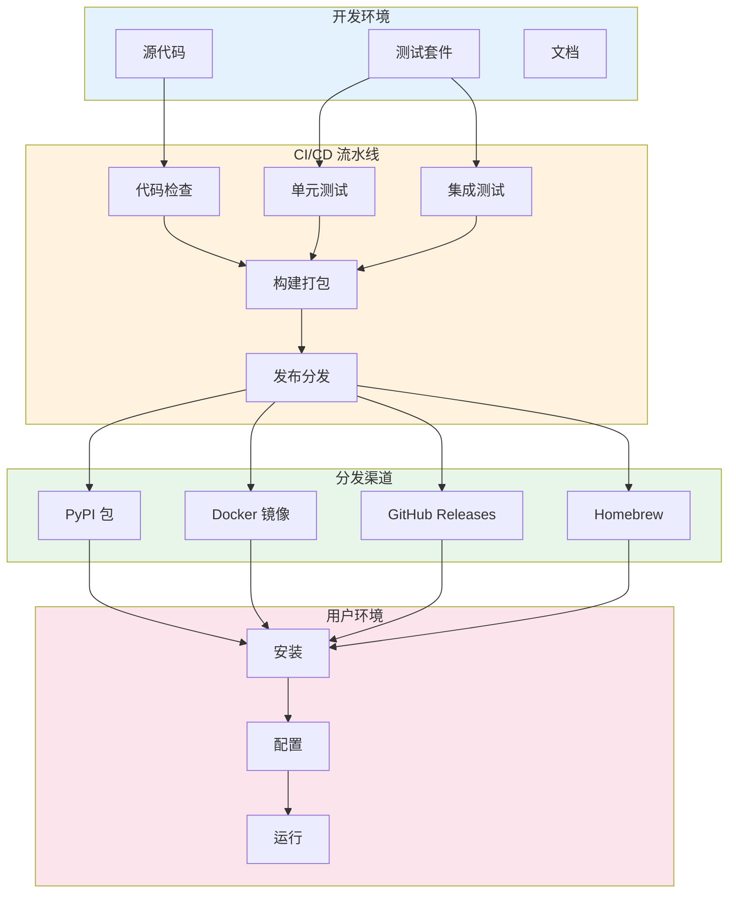

---

## 分发策略

### 1. 多平台分发矩阵

| 分发渠道 | 优先级 | 目标用户 | 技术实现 | 自动化程度 |
|---------|--------|---------|---------|-----------|
| **PyPI** | P0 | Python 开发者 | `twine` + `build` | 全自动 |
| **Docker Hub** | P1 | DevOps/容器化用户 | `docker buildx` | 全自动 |
| **GitHub Releases** | P1 | 所有用户 | `gh release` | 全自动 |
| **Homebrew** | P2 | macOS 用户 | `brew` formula | 半自动 |
| **APT/YUM** | P3 | Linux 企业用户 | 包构建脚本 | 手动 |

### 2. 分发渠道详细设计

#### 2.1 PyPI 包分发

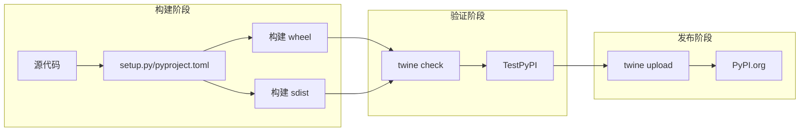

**配置要点：**
- 使用 `pyproject.toml` 现代构建配置
- 支持 Python 3.9-3.12
- 平台标签：`py3-none-any`（纯 Python）
- 元数据完整性：README、LICENSE、classifiers

#### 2.2 Docker 镜像分发

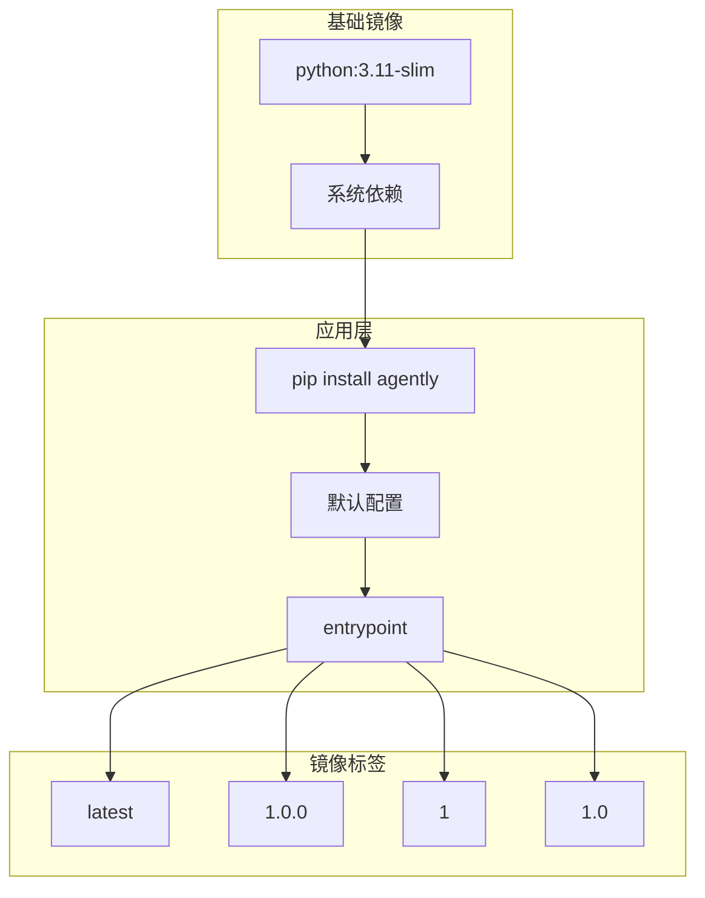

**镜像策略：**
- 基础镜像：`python:3.11-slim`
- 多架构支持：`linux/amd64`, `linux/arm64`
- 标签策略：`latest`, `{major}`, `{major.minor}`, `{major.minor.patch}`
- 镜像大小目标：< 200MB

#### 2.3 GitHub Releases 二进制分发

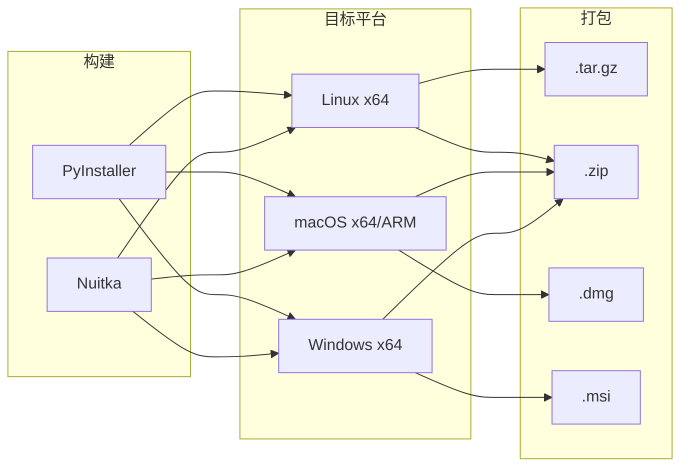

---

## CI/CD 流水线设计

### 1. 流水线架构

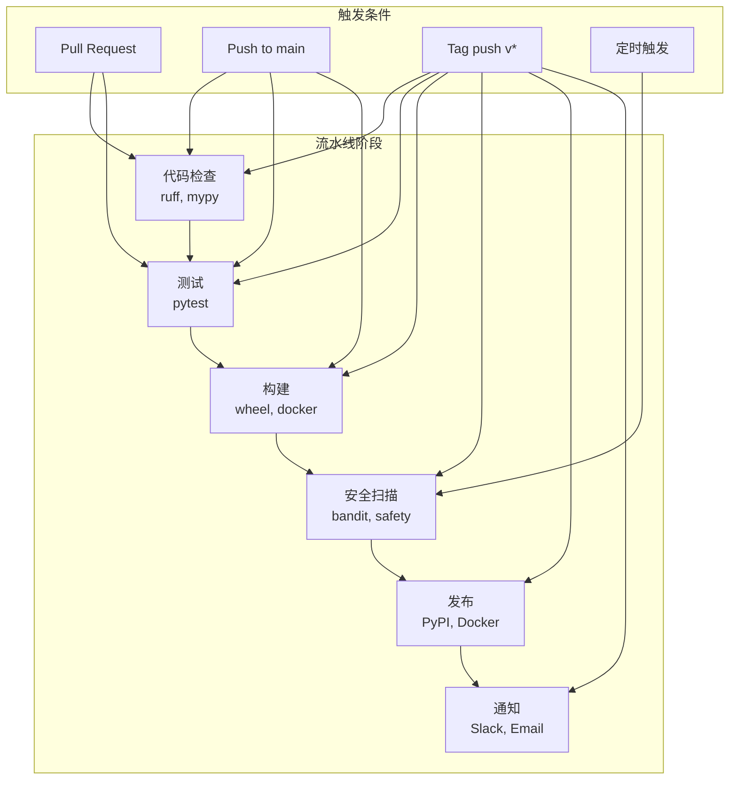

### 2. GitHub Actions 工作流

#### 2.1 持续集成工作流 (ci.yml)

```yaml
name: CI

on:
  push:
    branches: [main, develop]
  pull_request:
    branches: [main]

jobs:
  lint:
    runs-on: ubuntu-latest
    steps:
      - uses: actions/checkout@v4
      - uses: actions/setup-python@v5
        with:
          python-version: '3.11'
      - run: pip install ruff mypy
      - run: ruff check .
      - run: ruff format --check .
      - run: mypy src/

  test:
    runs-on: ${{ matrix.os }}
    strategy:
      matrix:
        os: [ubuntu-latest, macos-latest, windows-latest]
        python: ['3.9', '3.10', '3.11', '3.12']
    steps:
      - uses: actions/checkout@v4
      - uses: actions/setup-python@v5
        with:
          python-version: ${{ matrix.python }}
      - run: pip install -e ".[dev]"
      - run: pytest --cov=agently --cov-report=xml
      - uses: codecov/codecov-action@v3
        with:
          files: ./coverage.xml
```

#### 2.2 发布工作流 (release.yml)

```yaml
name: Release

on:
  push:
    tags:
      - 'v*'

jobs:
  build-and-publish:
    runs-on: ubuntu-latest
    steps:
      - uses: actions/checkout@v4
      - uses: actions/setup-python@v5
        with:
          python-version: '3.11'
      
      - name: Build package
        run: |
          pip install build twine
          python -m build
      
      - name: Publish to PyPI
        uses: pypa/gh-action-pypi-publish@release/v1
        with:
          password: ${{ secrets.PYPI_API_TOKEN }}
      
      - name: Build Docker image
        run: |
          docker buildx create --use
          docker buildx build \
            --platform linux/amd64,linux/arm64 \
            --tag yunlongwen/agently:${{ github.ref_name }} \
            --tag yunlongwen/agently:latest \
            --push .
      
      - name: Create GitHub Release
        uses: softprops/action-gh-release@v1
        with:
          files: dist/*
          generate_release_notes: true
```

---

## 版本管理策略

### 1. 语义化版本控制 (SemVer)

```
版本格式：主版本号.次版本号.修订号
示例：1.2.3

主版本号(Major)：不兼容的 API 修改
次版本号(Minor)：向下兼容的功能新增
修订号(Patch)：向下兼容的问题修复
```

### 2. 版本发布流程

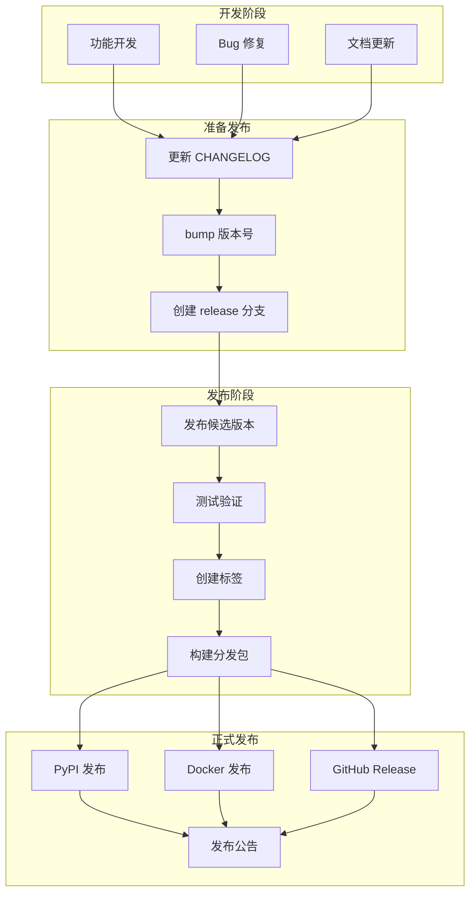

### 3. 预发布版本策略

| 版本类型 | 格式 | 用途 | 稳定性 |
|---------|------|------|--------|
| Alpha | `1.0.0a1` | 内部测试 | 不稳定 |
| Beta | `1.0.0b1` | 公开测试 | 基本功能可用 |
| RC | `1.0.0rc1` | 发布候选 | 接近正式版 |
| Stable | `1.0.0` | 正式版本 | 生产可用 |

---

## 配置管理

### 1. 配置文件层级

```mermaid
flowchart TB
    subgraph GLOBAL["全局配置"]
        SYSTEM[/etc/agently/config.yaml]
    end
    
    subgraph USER["用户配置"]
        HOME[~/.config/agently/config.yaml]
    end
    
    subgraph PROJECT["项目配置"]
        LOCAL[./.agently/config.yaml]
    end
    
    subgraph ENV["环境变量"]
        VARS[AGENTLY_*]
    end
    
    subgraph CLI["命令行参数"]
        ARGS[--option value]
    end
    
    SYSTEM --> CONFIG[配置合并]
    HOME --> CONFIG
    LOCAL --> CONFIG
    VARS --> CONFIG
    ARGS --> CONFIG
    
    CONFIG --> FINAL[最终配置]
```

### 2. 配置优先级（高 → 低）

1. 命令行参数
2. 环境变量
3. 项目本地配置 (./.agently/config.yaml)
4. 用户配置 (~/.config/agently/config.yaml)
5. 系统配置 (/etc/agently/config.yaml)
6. 默认配置

### 3. 敏感信息管理

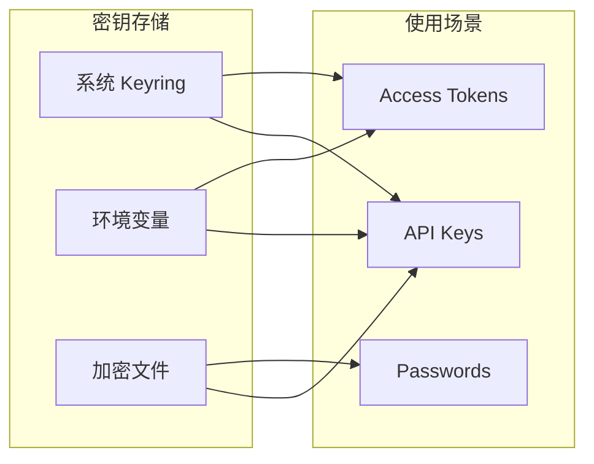

**实现方案：**
- 首选：系统 keyring（keyring 库）
- 备选：环境变量（开发环境）
- 备选：加密配置文件（~/.agently/secrets.enc）

---

## 更新机制

### 1. 自动更新检查

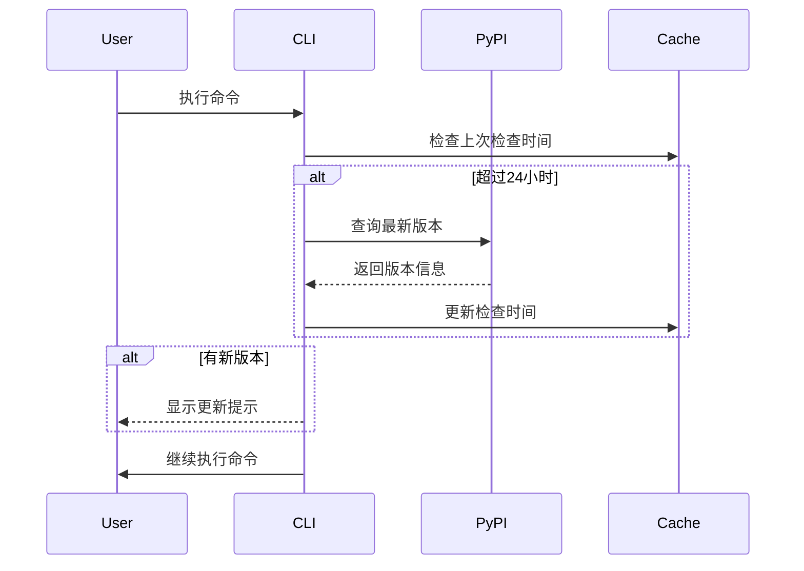

### 2. 更新命令设计

```bash
# 检查更新
agently update check

# 执行更新
agently update install

# 查看版本信息
agently version

# 查看详细版本信息
agently version --verbose
```

---

## 回滚策略

### 1. 版本回滚流程

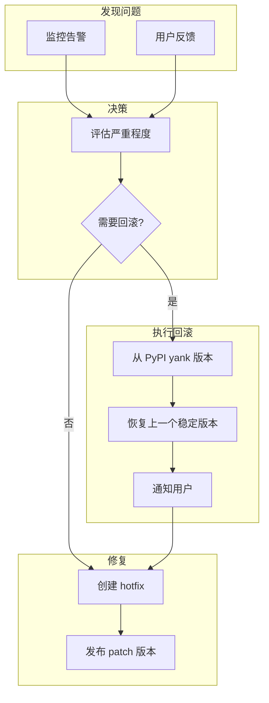

### 2. 回滚操作

```bash
# PyPI 回滚（yank 版本）
twine yank agently==1.0.1

# Docker 回滚（删除标签）
docker rmi yunlongwen/agently:1.0.1

# GitHub Release 标记为预发布
gh release edit v1.0.1 --prerelease
```

---

## 监控与可观测性

### 1. 部署监控指标

| 指标类别 | 指标名称 | 说明 |
|---------|---------|------|
| **下载量** | PyPI downloads | 包下载统计 |
| **安装成功率** | Install success rate | pip install 成功率 |
| **版本分布** | Version adoption | 各版本使用占比 |
| **错误率** | Error rate | 安装/运行错误率 |
| **性能** | Install time | 安装耗时 |

### 2. 监控工具集成

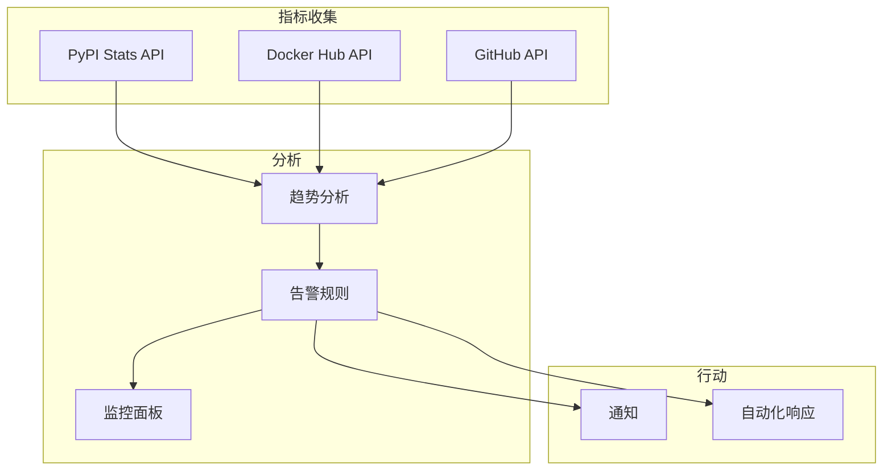

---

## 安全考虑

### 1. 供应链安全

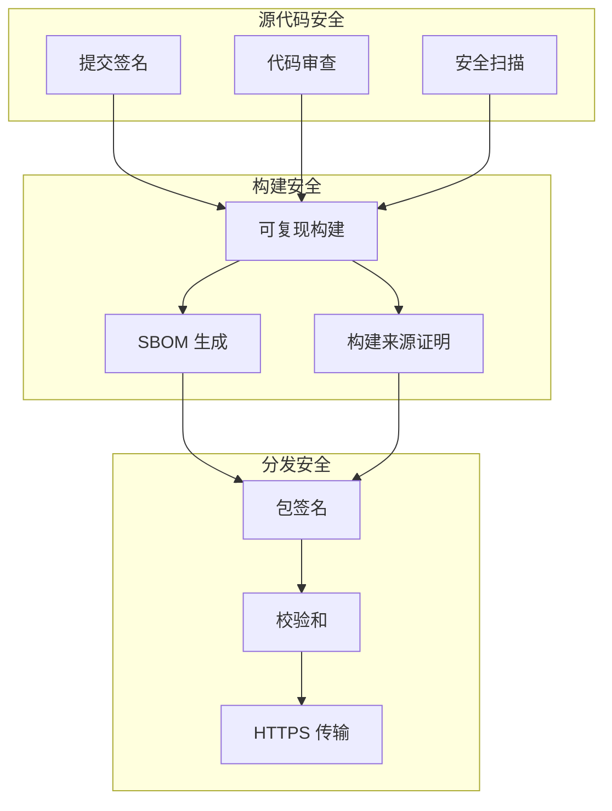

### 2. 安全扫描工具

| 工具 | 用途 | 集成阶段 |
|------|------|---------|
| **bandit** | Python 安全漏洞扫描 | CI |
| **safety** | 依赖包安全扫描 | CI |
| **semgrep** | 静态代码分析 | CI |
| **snyk** | 依赖漏洞监控 | CI/CD |
| **sigstore** | 包签名验证 | 发布 |

---

## 实施路线图

### Phase 1: 基础部署 (MVP)
- [ ] PyPI 自动发布
- [ ] GitHub Actions CI/CD
- [ ] 基础版本管理
- [ ] 文档自动部署

### Phase 2: 容器化 (v1.1)
- [ ] Docker 镜像构建
- [ ] 多架构支持
- [ ] Docker Compose 示例
- [ ] Kubernetes 部署示例

### Phase 3: 多平台分发 (v1.2)
- [ ] Homebrew formula
- [ ] APT/YUM 仓库
- [ ] Windows Installer (MSI)
- [ ] macOS App Bundle

### Phase 4: 高级功能 (v1.3)
- [ ] 自动更新机制
- [ ] 灰度发布
- [ ] 遥测数据收集
- [ ] 性能监控面板

---

## 参考项目

### CLI 工具部署最佳实践

| 项目 | 分发方式 | 特点 |
|------|---------|------|
| **Poetry** | PyPI + 安装脚本 | 现代化 Python 包管理 |
| **Black** | PyPI + GitHub Actions | 简单高效的 CI/CD |
| **HTTPie** | PyPI + Homebrew | 多平台支持 |
| **Docker Compose** | PyPI + Docker Hub | 容器化优先 |
| **AWS CLI** | PyPI + 安装程序 | 企业级分发 |

---

## 附录

### A. 配置文件示例

#### pyproject.toml

```toml
[build-system]
requires = ["hatchling"]
build-backend = "hatchling.build"

[project]
name = "agently"
version = "0.1.0"
description = "AI驱动的编程助手"
readme = "README.md"
license = {text = "MIT"}
requires-python = ">=3.9"
classifiers = [
    "Development Status :: 3 - Alpha",
    "Intended Audience :: Developers",
    "License :: OSI Approved :: MIT License",
    "Programming Language :: Python :: 3",
    "Programming Language :: Python :: 3.9",
    "Programming Language :: Python :: 3.10",
    "Programming Language :: Python :: 3.11",
    "Programming Language :: Python :: 3.12",
]
dependencies = [
    "click>=8.1.7",
    "langchain>=0.3.28",
    "httpx>=0.27.0",
    "structlog>=23.2.0",
]

[project.optional-dependencies]
dev = [
    "pytest>=7.4.0",
    "pytest-cov>=4.1.0",
    "ruff>=0.4.0",
    "mypy>=1.10.0",
]

[project.scripts]
agently = "agently.cli:main"

[project.urls]
Homepage = "https://github.com/yunlongwen/agently"
Documentation = "https://yunlongwen.github.io/agently"
Repository = "https://github.com/yunlongwen/agently"
Issues = "https://github.com/yunlongwen/agently/issues"
```

#### Dockerfile

```dockerfile
FROM python:3.11-slim

WORKDIR /app

# 安装系统依赖
RUN apt-get update && apt-get install -y \
    git \
    && rm -rf /var/lib/apt/lists/*

# 安装 agently
RUN pip install --no-cache-dir agently

# 创建非 root 用户
RUN useradd -m -u 1000 agently
USER agently

# 设置工作目录
WORKDIR /workspace

ENTRYPOINT ["agently"]
CMD ["--help"]
```

### B. 发布检查清单

- [ ] 版本号已更新
- [ ] CHANGELOG 已更新
- [ ] 所有测试通过
- [ ] 文档已更新
- [ ] 安全扫描通过
- [ ] 构建产物验证
- [ ] 发布标签已创建
- [ ] PyPI 发布成功
- [ ] Docker 镜像推送成功
- [ ] GitHub Release 已创建
- [ ] 发布公告已发送

---

**文档版本**: v1.0  
**最后更新**: 2026-03-07  
**维护者**: Agently 开发团队
