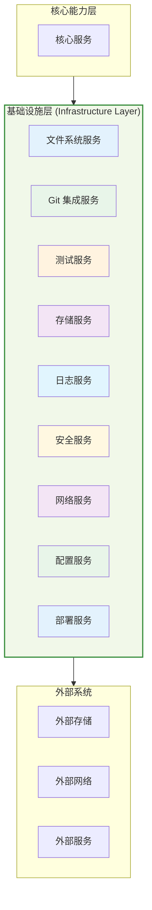
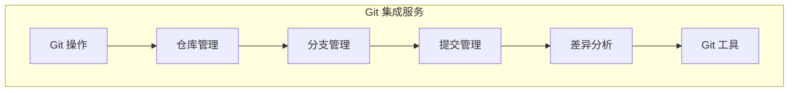
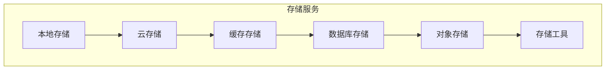
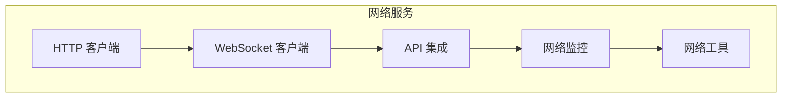
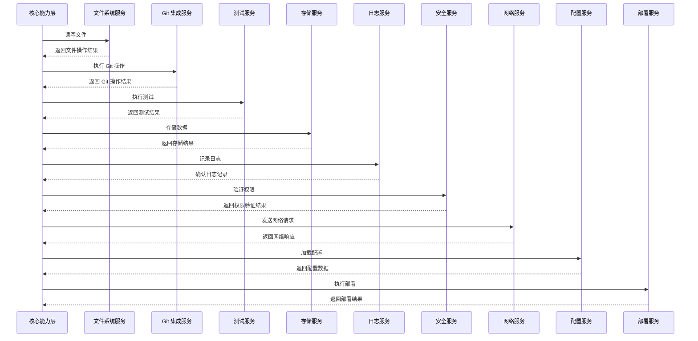

# Agently 基础设施层架构设计

## 文档说明

本文档详细描述 Agently 基础设施层的架构设计，包括文件系统、Git 集成、测试、存储、日志、安全、网络、配置和部署等基础设施服务。

---

## 基础设施层架构概览



---

## 1. 文件系统服务

### 1.1 核心功能


### 1.2 技术实现

#### 文件操作
- **读写操作**：高效的文件读写
- **权限管理**：文件权限控制
- **文件锁定**：支持文件锁定机制
- **事务支持**：支持文件操作事务

#### 目录管理
- **目录遍历**：递归遍历目录结构
- **目录监控**：监控目录变化
- **路径解析**：智能路径解析和规范化
- **目录操作**：创建、删除、移动目录

#### 文件监控
- **实时监控**：实时监控文件变化
- **事件触发**：基于文件变化触发事件
- **批量处理**：支持批量文件操作
- **防抖机制**：文件变更防抖处理

#### 文件缓存
- **内存缓存**：常用文件的内存缓存
- **缓存策略**：智能缓存策略
- **缓存失效**：自动缓存失效机制
- **性能优化**：缓存性能优化

#### 文件工具
- **文件搜索**：快速文件搜索
- **文件比较**：文件内容比较
- **文件转换**：文件格式转换
- **文件压缩**：文件压缩和解压缩

### 1.3 性能优化

- **异步操作**：异步文件操作
- **缓冲机制**：文件读写缓冲
- **批量处理**：批量文件操作
- **并行处理**：并行文件处理
- **内存映射**：大文件内存映射

---

## 2. Git 集成服务

### 2.1 核心功能



### 2.2 技术实现

#### Git 操作
- **命令执行**：执行 Git 命令
- **结果解析**：解析 Git 命令结果
- **错误处理**：Git 错误处理
- **进度跟踪**：Git 操作进度跟踪

#### 仓库管理
- **克隆仓库**：克隆远程仓库
- **初始化仓库**：初始化本地仓库
- **远程管理**：管理远程仓库
- **仓库配置**：配置仓库设置

#### 分支管理
- **创建分支**：创建新分支
- **切换分支**：切换分支
- **合并分支**：合并分支
- **删除分支**：删除分支

#### 提交管理
- **提交代码**：提交代码更改
- **撤销提交**：撤销错误提交
- **提交历史**：查看提交历史
- **提交消息**：生成和管理提交消息

#### 差异分析
- **文件差异**：分析文件差异
- **提交差异**：分析提交差异
- **分支差异**：分析分支差异
- **变更统计**：统计代码变更

#### Git 工具
- **冲突解决**：辅助解决冲突
- **标签管理**：管理 Git 标签
- **子模块管理**：管理 Git 子模块
- **钩子管理**：管理 Git 钩子

### 2.3 性能优化

- **增量操作**：增量 Git 操作
- **并行执行**：并行 Git 命令执行
- **缓存机制**：Git 操作结果缓存
- **批量处理**：批量 Git 操作
- **懒加载**：按需加载 Git 信息

---

## 3. 测试服务

### 3.1 核心功能


### 3.2 技术实现

#### 测试发现
- **自动发现**：自动发现测试文件
- **测试分类**：按类型分类测试
- **测试过滤**：按条件过滤测试
- **测试排序**：智能测试排序

#### 测试执行
- **并行执行**：并行执行测试
- **增量测试**：增量测试执行
- **测试重试**：失败测试自动重试
- **测试超时**：测试执行超时控制

#### 测试报告
- **实时报告**：实时测试报告
- **详细报告**：详细测试结果报告
- **趋势分析**：测试结果趋势分析
- **问题定位**：测试失败问题定位

#### 测试覆盖
- **代码覆盖**：代码覆盖率分析
- **分支覆盖**：分支覆盖率分析
- **路径覆盖**：路径覆盖率分析
- **覆盖报告**：覆盖率报告生成

#### 测试模拟
- **依赖模拟**：模拟外部依赖
- **行为模拟**：模拟函数行为
- **数据模拟**：模拟测试数据
- **环境模拟**：模拟测试环境

#### 测试工具
- **测试生成**：自动生成测试用例
- **测试优化**：优化测试执行
- **测试分析**：分析测试结果
- **测试维护**：维护测试用例

### 3.3 性能优化

- **并行执行**：多线程测试执行
- **增量测试**：只执行变更相关的测试
- **测试缓存**：缓存测试结果
- **资源共享**：测试资源共享
- **智能调度**：智能测试调度策略

---

## 4. 存储服务

### 4.1 核心功能



### 4.2 技术实现

#### 本地存储
- **文件存储**：本地文件存储
- **数据持久化**：数据持久化
- **配置存储**：配置文件存储
- **临时存储**：临时数据存储

#### 云存储
- **云服务集成**：集成云存储服务
- **数据同步**：本地与云存储同步
- **备份恢复**：数据备份和恢复
- **版本控制**：存储版本控制

#### 缓存存储
- **内存缓存**：内存数据缓存
- **磁盘缓存**：磁盘数据缓存
- **缓存策略**：智能缓存策略
- **缓存一致性**：缓存数据一致性

#### 数据库存储
- **数据库连接**：数据库连接管理
- **数据查询**：数据查询和检索
- **数据更新**：数据更新和删除
- **事务管理**：数据库事务管理

#### 对象存储
- **对象管理**：对象的创建、读取、更新、删除
- **元数据管理**：对象元数据管理
- **访问控制**：对象访问控制
- **数据加密**：对象数据加密

#### 存储工具
- **数据迁移**：数据迁移工具
- **数据备份**：数据备份工具
- **数据恢复**：数据恢复工具
- **数据清理**：数据清理工具

### 4.3 性能优化

- **缓存机制**：多级缓存机制
- **异步操作**：异步存储操作
- **批量处理**：批量存储操作
- **连接池**：数据库连接池
- **索引优化**：数据索引优化

---

## 5. 日志服务

### 5.1 核心功能


### 5.2 技术实现

#### 日志生成
- **结构化日志**：生成结构化日志
- **日志级别**：支持不同级别的日志
- **上下文信息**：包含上下文信息
- **性能指标**：记录性能指标

#### 日志聚合
- **多源聚合**：聚合多个来源的日志
- **实时聚合**：实时日志聚合
- **批量聚合**：批量日志聚合
- **格式统一**：统一日志格式

#### 日志分析
- **模式识别**：识别日志模式
- **异常检测**：检测异常日志
- **趋势分析**：分析日志趋势
- **关联分析**：分析日志关联

#### 日志存储
- **本地存储**：本地日志存储
- **远程存储**：远程日志存储
- **压缩存储**：日志压缩存储
- **轮转策略**：日志轮转策略

#### 日志搜索
- **全文搜索**：日志全文搜索
- **条件搜索**：条件过滤搜索
- **时间范围**：时间范围搜索
- **结果高亮**：搜索结果高亮

#### 日志工具
- **日志清理**：日志清理工具
- **日志归档**：日志归档工具
- **日志导出**：日志导出工具
- **日志监控**：日志监控工具

### 5.3 性能优化

- **异步写入**：异步日志写入
- **缓冲机制**：日志写入缓冲
- **批量处理**：批量日志处理
- **压缩存储**：压缩日志存储
- **索引优化**：日志索引优化

---

## 6. 安全服务

### 6.1 核心功能


### 6.2 技术实现

#### 认证服务
- **用户认证**：用户身份认证
- **API 认证**：API 访问认证
- **Token 管理**：Token 生成和管理
- **会话管理**：用户会话管理

#### 授权服务
- **权限管理**：基于角色的权限管理
- **访问控制**：细粒度访问控制
- **权限验证**：权限验证和检查
- **权限审计**：权限使用审计

#### 加密服务
- **数据加密**：敏感数据加密
- **传输加密**：数据传输加密
- **密钥管理**：加密密钥管理
- **哈希计算**：数据哈希计算

#### 漏洞扫描
- **代码扫描**：代码安全扫描
- **依赖扫描**：依赖包安全扫描
- **配置扫描**：配置安全扫描
- **漏洞评估**：漏洞风险评估

#### 安全监控
- **异常检测**：安全异常检测
- **入侵检测**：入侵行为检测
- **安全告警**：安全事件告警
- **安全审计**：安全事件审计

#### 安全工具
- **安全测试**：安全测试工具
- **安全分析**：安全分析工具
- **安全修复**：安全问题修复工具
- **安全报告**：安全报告生成工具

### 6.3 性能优化

- **缓存机制**：认证和授权缓存
- **异步处理**：异步安全扫描
- **批量验证**：批量权限验证
- **优化算法**：加密算法优化
- **资源隔离**：安全服务资源隔离

---

## 7. 网络服务

### 7.1 核心功能



### 7.2 技术实现

#### HTTP 客户端
- **请求管理**：HTTP 请求管理
- **响应处理**：HTTP 响应处理
- **会话管理**：HTTP 会话管理
- **超时控制**：HTTP 请求超时控制

#### WebSocket 客户端
- **连接管理**：WebSocket 连接管理
- **消息处理**：WebSocket 消息处理
- **重连机制**：WebSocket 自动重连
- **心跳检测**：WebSocket 心跳检测

#### API 集成
- **API 调用**：外部 API 调用
- **参数处理**：API 参数处理
- **响应解析**：API 响应解析
- **错误处理**：API 错误处理

#### 网络监控
- **网络状态**：网络状态监控
- **性能监控**：网络性能监控
- **错误监控**：网络错误监控
- **流量监控**：网络流量监控

#### 网络工具
- **网络测试**：网络连接测试
- **代理管理**：网络代理管理
- **重试机制**：网络请求重试
- **速率限制**：网络请求速率限制

### 7.3 性能优化

- **连接池**：HTTP 连接池
- **并发请求**：并发网络请求
- **缓存机制**：网络响应缓存
- **压缩传输**：数据压缩传输
- **智能重试**：智能网络请求重试

---

## 8. 配置服务

### 8.1 核心功能


### 8.2 技术实现

#### 配置加载
- **文件加载**：从文件加载配置
- **环境变量**：从环境变量加载配置
- **远程加载**：从远程服务加载配置
- **默认配置**：提供默认配置

#### 配置管理
- **配置合并**：合并多个配置源
- **配置覆盖**：配置覆盖机制
- **配置继承**：配置继承机制
- **配置版本**：配置版本管理

#### 配置验证
- **格式验证**：配置格式验证
- **值验证**：配置值验证
- **依赖验证**：配置依赖验证
- **一致性验证**：配置一致性验证

#### 配置监控
- **实时监控**：实时监控配置变化
- **热更新**：配置热更新
- **变更通知**：配置变更通知
- **变更审计**：配置变更审计

#### 配置工具
- **配置生成**：自动生成配置
- **配置备份**：配置备份和恢复
- **配置比较**：配置比较工具
- **配置文档**：配置文档生成

### 8.3 性能优化

- **缓存机制**：配置缓存
- **懒加载**：配置懒加载
- **预加载**：配置预加载
- **增量更新**：配置增量更新
- **并行加载**：并行配置加载

---

## 9. 部署服务

### 9.1 核心功能


### 9.2 技术实现

#### 部署流水线
- **构建流程**：代码构建流程
- **测试流程**：自动化测试流程
- **部署流程**：自动化部署流程
- **回滚流程**：部署回滚流程

#### 环境管理
- **环境配置**：环境配置管理
- **环境隔离**：环境隔离机制
- **环境复制**：环境复制和克隆
- **环境清理**：环境清理和回收

#### 包管理
- **依赖管理**：依赖包管理
- **包构建**：软件包构建
- **包发布**：软件包发布
- **包版本**：包版本管理

#### 部署监控
- **部署状态**：部署状态监控
- **健康检查**：服务健康检查
- **性能监控**：部署性能监控
- **错误监控**：部署错误监控

#### 部署工具
- **部署脚本**：部署脚本管理
- **部署模板**：部署模板管理
- **部署自动化**：部署自动化工具
- **部署文档**：部署文档生成

### 9.3 性能优化

- **并行构建**：并行构建和测试
- **增量部署**：增量部署
- **缓存机制**：构建缓存
- **资源优化**：部署资源优化
- **自动化**：自动化部署流程

---

## 基础设施服务数据流

### 典型工作流程



---

## 基础设施服务 API 设计

### 文件系统服务 API

```python
class FileSystemService:
    def read_file(self, path: str) -> str:
        """读取文件"""
        pass
    
    def write_file(self, path: str, content: str) -> bool:
        """写入文件"""
        pass
    
    def list_directory(self, path: str) -> List[str]:
        """列出目录内容"""
        pass
    
    def watch_file(self, path: str, callback: Callable) -> Watcher:
        """监控文件变化"""
        pass
```

### Git 集成服务 API

```python
class GitIntegrationService:
    def clone_repository(self, url: str, path: str) -> bool:
        """克隆仓库"""
        pass
    
    def commit(self, message: str, files: List[str] = None) -> str:
        """提交代码"""
        pass
    
    def checkout_branch(self, branch: str) -> bool:
        """切换分支"""
        pass
    
    def get_diff(self, commit1: str, commit2: str) -> str:
        """获取差异"""
        pass
```

### 测试服务 API

```python
class TestService:
    def discover_tests(self, path: str) -> List[str]:
        """发现测试"""
        pass
    
    def run_tests(self, tests: List[str] = None) -> TestResult:
        """运行测试"""
        pass
    
    def generate_test_report(self, result: TestResult) -> str:
        """生成测试报告"""
        pass
    
    def get_coverage(self) -> CoverageReport:
        """获取测试覆盖率"""
        pass
```

### 存储服务 API

```python
class StorageService:
    def store(self, key: str, value: Any) -> bool:
        """存储数据"""
        pass
    
    def retrieve(self, key: str) -> Any:
        """检索数据"""
        pass
    
    def delete(self, key: str) -> bool:
        """删除数据"""
        pass
    
    def list_keys(self, prefix: str = "") -> List[str]:
        """列出键"""
        pass
```

### 日志服务 API

```python
class LogService:
    def log(self, level: str, message: str, **context) -> None:
        """记录日志"""
        pass
    
    def search_logs(self, query: str, start_time: datetime = None, end_time: datetime = None) -> List[LogEntry]:
        """搜索日志"""
        pass
    
    def analyze_logs(self, pattern: str) -> LogAnalysis:
        """分析日志"""
        pass
    
    def export_logs(self, start_time: datetime, end_time: datetime) -> str:
        """导出日志"""
        pass
```

### 安全服务 API

```python
class SecurityService:
    def authenticate(self, username: str, password: str) -> Token:
        """认证用户"""
        pass
    
    def authorize(self, token: str, resource: str, action: str) -> bool:
        """授权访问"""
        pass
    
    def encrypt(self, data: str) -> str:
        """加密数据"""
        pass
    
    def decrypt(self, encrypted_data: str) -> str:
        """解密数据"""
        pass
```

### 网络服务 API

```python
class NetworkService:
    def send_request(self, url: str, method: str = "GET", **kwargs) -> Response:
        """发送 HTTP 请求"""
        pass
    
    def connect_websocket(self, url: str, on_message: Callable) -> WebSocket:
        """连接 WebSocket"""
        pass
    
    def test_connection(self, host: str, port: int) -> bool:
        """测试网络连接"""
        pass
    
    def get_network_status(self) -> NetworkStatus:
        """获取网络状态"""
        pass
```

### 配置服务 API

```python
class ConfigService:
    def load_config(self, name: str) -> Dict[str, Any]:
        """加载配置"""
        pass
    
    def update_config(self, name: str, config: Dict[str, Any]) -> bool:
        """更新配置"""
        pass
    
    def validate_config(self, config: Dict[str, Any]) -> ValidationResult:
        """验证配置"""
        pass
    
    def watch_config(self, name: str, callback: Callable) -> Watcher:
        """监控配置变化"""
        pass
```

### 部署服务 API

```python
class DeployService:
    def build(self, project_path: str) -> BuildResult:
        """构建项目"""
        pass
    
    def deploy(self, environment: str, package: str) -> DeployResult:
        """部署项目"""
        pass
    
    def rollback(self, environment: str, version: str) -> RollbackResult:
        """回滚部署"""
        pass
    
    def get_deploy_status(self, environment: str) -> DeployStatus:
        """获取部署状态"""
        pass
```

---

## 实施路线图

### Phase 1: 基础服务
- 实现文件系统服务
- 实现 Git 集成服务
- 实现基础测试服务
- 实现本地存储服务
- 实现基础日志服务

### Phase 2: 核心功能
- 实现安全服务
- 实现网络服务
- 实现配置服务
- 实现部署服务
- 实现云存储集成

### Phase 3: 高级功能
- 实现文件监控和缓存
- 实现高级 Git 操作
- 实现测试覆盖率分析
- 实现分布式存储
- 实现高级日志分析

### Phase 4: 优化和扩展
- 性能优化
- 安全性增强
- 扩展性改进
- 自动化部署
- 监控和告警

---

## 核心特性对比

| 特性 | 传统基础设施 | Agently 基础设施 |
|------|--------------|------------------|
| **文件系统** | 基本文件操作 | 智能文件监控 + 缓存 |
| **Git 集成** | 手动 Git 操作 | 自动化 Git 管理 |
| **测试服务** | 基本测试执行 | 智能测试发现 + 覆盖率分析 |
| **存储服务** | 本地存储 | 多存储后端 + 缓存 |
| **日志服务** | 简单日志 | 结构化日志 + 分析 |
| **安全服务** | 基本认证 | 完整的安全体系 |
| **网络服务** | 基本 HTTP | 高级网络功能 + 监控 |
| **配置服务** | 静态配置 | 动态配置 + 监控 |
| **部署服务** | 手动部署 | 自动化部署 + 回滚 |

---

## 总结

Agently 基础设施层设计实现了：

1. **模块化架构**：清晰的服务边界和职责
2. **高性能设计**：各种性能优化技术的应用
3. **可靠性保障**：完善的错误处理和恢复机制
4. **安全性增强**：全面的安全服务体系
5. **可扩展性**：灵活的插件和扩展机制
6. **可观测性**：完整的监控和日志系统

这些基础设施服务为 Agently 提供了坚实的基础，确保系统的稳定运行和高效性能。

---

**文档版本**: v1.0  
**最后更新**: 2026-03-07  
**维护者**: Agently 开发团队