# Agently 智能体协调层架构设计

## 文档说明

本文档详细描述 Agently 智能体协调层的架构设计，包括 Nexus 综合智能体的核心组件、设计理念、任务调度机制、状态管理和工作流编排。

---

## 协调层架构概览

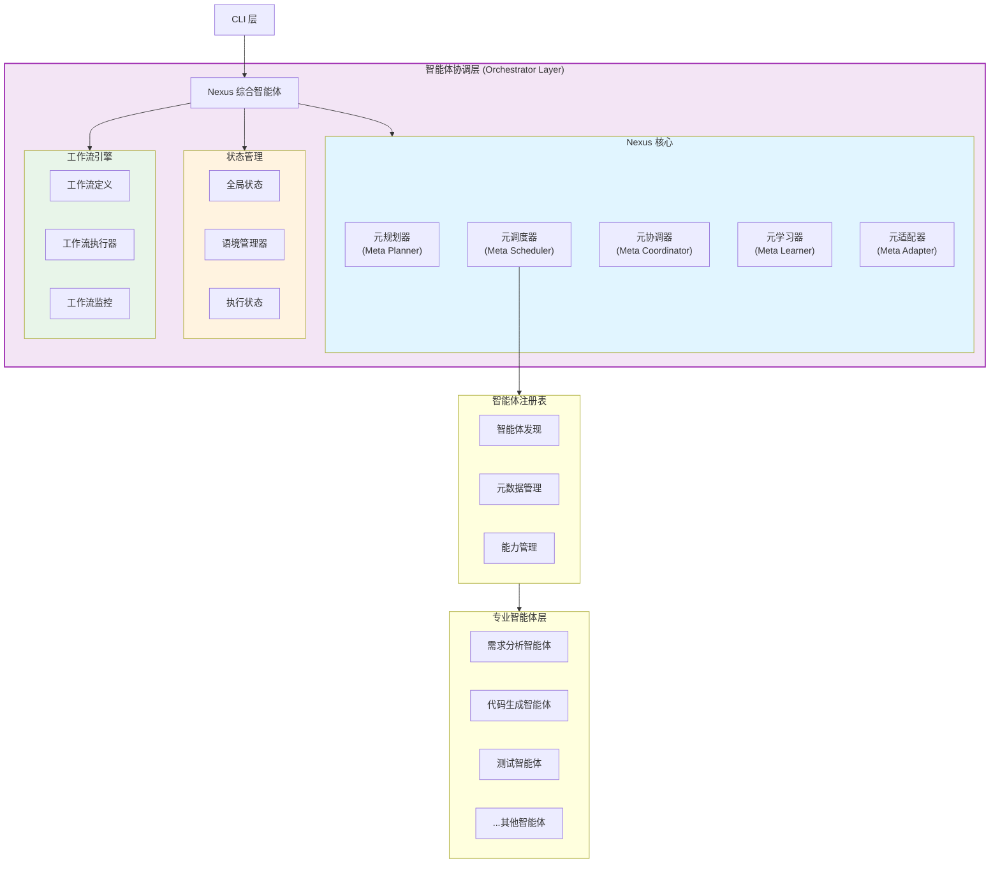

---

## 核心设计理念

### 1. 编排优先 (Orchestration-First)

**核心理念**：
- 真正的多智能体协作，而非单智能体串行执行
- "不解决问题不罢休"的持续执行模式
- 智能体之间的高效协调与信息传递

**架构演进**：

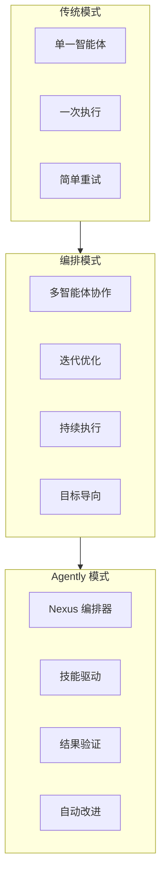

### 2. 技能驱动 (Skill-Driven)

**核心理念**：
- 将开发经验固化为可复用的技能
- 标准化流程，智能体主动遵循
- 技能的组合、复用和持续优化

**技能系统架构**：

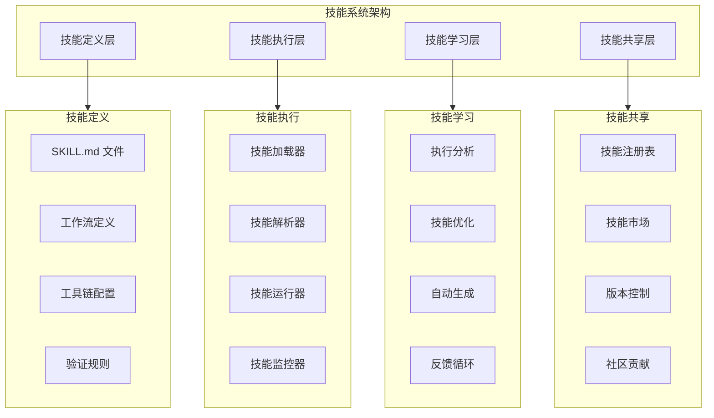

### 3. 多模型协调

**核心理念**：
- 支持多个大模型协同工作
- 根据任务特点动态选择最优模型
- 成本与质量的智能平衡

**多模型协调架构**：

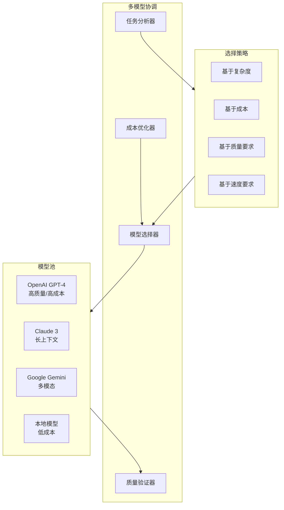

---

## Nexus 核心组件

### 1. 元规划器 (Meta Planner)

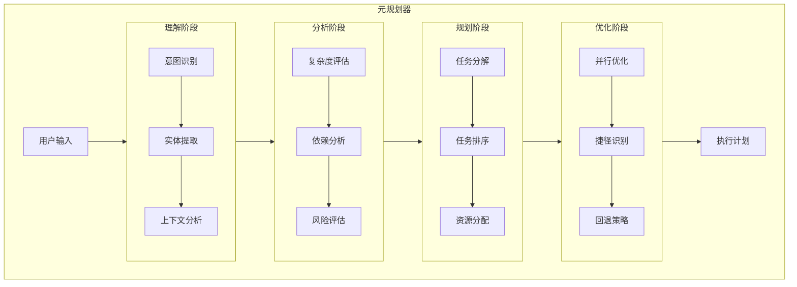

#### 核心职责

- **意图识别**：理解用户的真实意图和需求
- **任务分解**：将复杂任务分解为可执行的子任务
- **依赖分析**：识别任务间的依赖关系
- **计划生成**：生成优化的执行计划
- **风险评估**：评估执行风险并制定回退策略

#### 工作流程

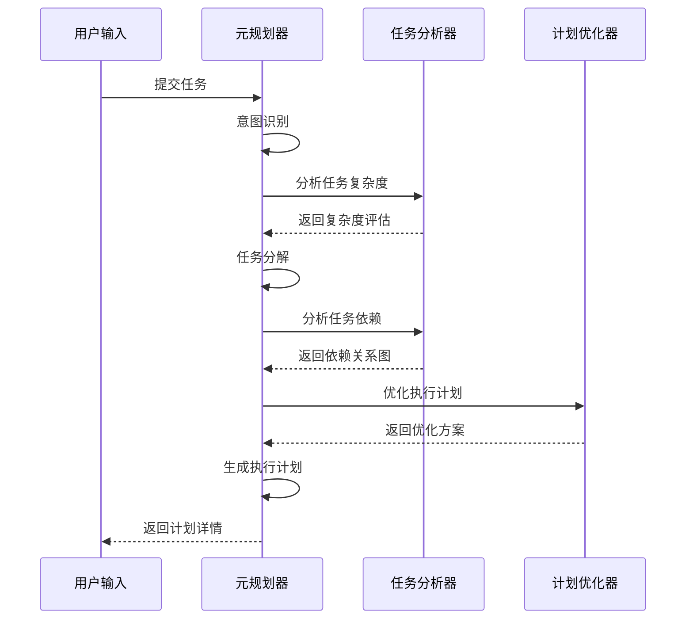

### 2. 元调度器 (Meta Scheduler)

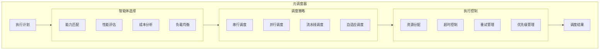

#### 核心职责

- **智能体选择**：根据任务特点选择最合适的智能体
- **调度策略**：决定任务执行顺序（串行、并行、流水线）
- **资源分配**：分配计算资源和 API 配额
- **负载均衡**：平衡多个智能体的工作负载
- **超时控制**：管理任务执行时间和重试机制

#### 调度算法

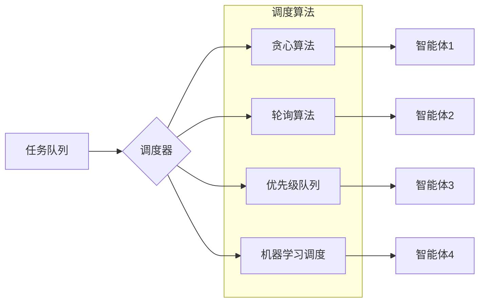

### 3. 元协调器 (Meta Coordinator)

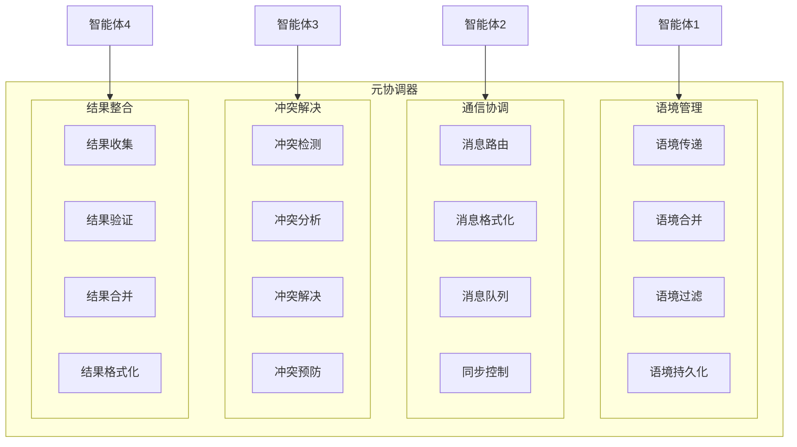

#### 核心职责

- **语境传递**：在智能体间传递上下文信息
- **消息路由**：管理智能体间的通信
- **冲突解决**：检测和解决智能体间的冲突
- **结果整合**：汇总多个智能体的执行结果
- **同步控制**：协调并行执行的任务

### 4. 元学习器 (Meta Learner)

```mermaid
flowchart TD
    subgraph Meta_Learner["元学习器"]
        subgraph Data_Collection["数据收集"]
            EXEC_LOG[执行日志]
            PERF_METRICS[性能指标]
            USER_FEEDBACK[用户反馈]
            ERROR_LOG[错误日志]
        end
        
        subgraph Analysis["分析阶段"]
            PATTERN[模式识别]
            BOTTLENECK[瓶颈分析]
            SUCCESS_FACTOR[成功因素分析]
            FAILURE_ANALYSIS[失败分析]
        end
        
        subgraph Learning["学习阶段"]
            STRATEGY_OPT[策略优化]
            PARAM_TUNING[参数调优]
            MODEL_UPDATE[模型更新]
            KNOWLEDGE_BASE[知识库更新]
        end
        
        subgraph Adaptation["自适应"]
            REAL_TIME_ADJ[实时调整]
            PREDICTIVE_ADJ[预测性调整]
            PERSONALIZATION[个性化适配]
        end
    end
    
    Data_Collection --> Analysis
    Analysis --> Learning
    Learning --> Adaptation
```

#### 核心职责

- **性能分析**：分析执行历史和性能指标
- **策略优化**：基于历史数据优化调度策略
- **参数调优**：自动调整系统参数
- **知识积累**：积累任务执行经验和最佳实践
- **自适应调整**：根据实时反馈动态调整

### 5. 元适配器 (Meta Adapter)

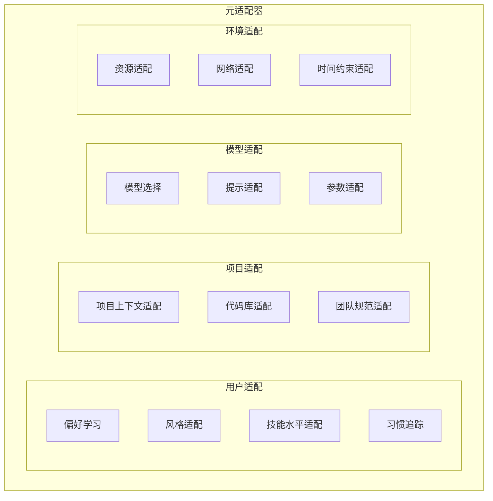

#### 核心职责

- **用户偏好适配**：学习并适应用户的偏好和习惯
- **项目上下文适配**：根据项目特点调整策略
- **模型选择适配**：根据任务选择最合适的模型
- **环境适配**：根据运行环境调整配置

---

## 核心协调模式

### 模式 1：技能驱动的协调模式

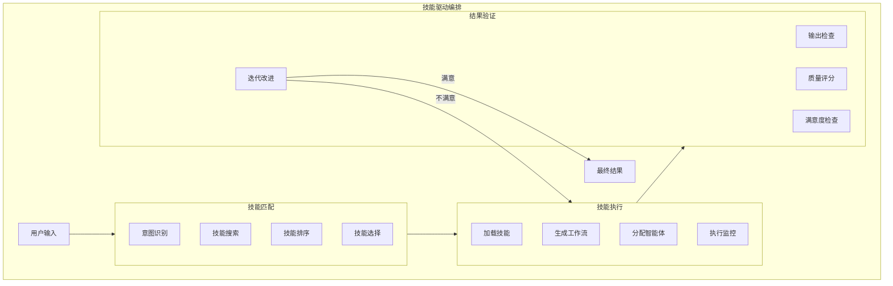

**核心设计点**：
1. **技能优先**：先匹配技能，再协调智能体
2. **标准化流程**：技能定义标准执行流程
3. **结果验证**：自动验证执行结果，不满意则迭代
4. **持续优化**：从执行中学习，优化技能

### 模式 2：持续执行模式 (Persistent Execution)

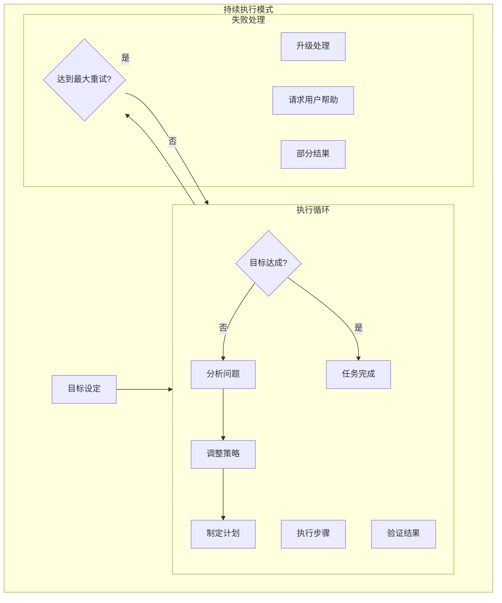

**核心设计点**：
1. **目标导向**：以达成目标为终止条件，而非执行次数
2. **自动调整**：失败时自动分析原因并调整策略
3. **升级机制**：无法解决时升级处理或请求用户帮助
4. **部分结果**：即使未完全成功，也返回已有进展

### 模式 3：智能体能力市场

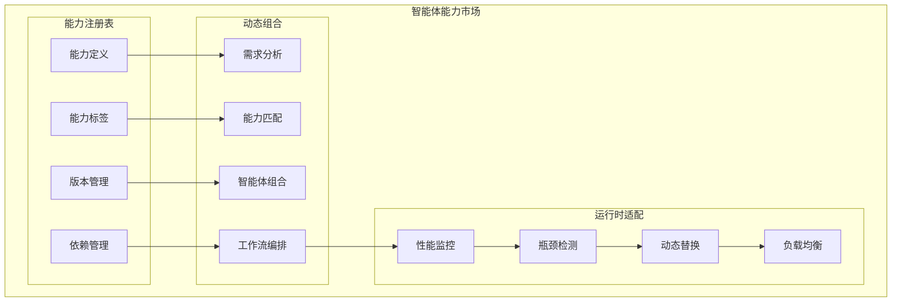

**核心设计点**：
1. **能力粒度**：细粒度的能力定义，便于组合
2. **动态组合**：根据需求动态组合智能体能力
3. **运行时优化**：监控执行性能，动态调整组合
4. **版本管理**：支持能力的版本控制和兼容性管理

### 模式 4：语境感知协调

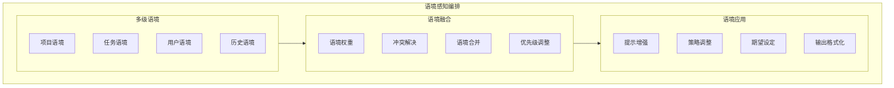

**核心设计点**：
1. **多级语境**：项目、任务、用户、历史四个层面的语境
2. **智能融合**：自动解决语境冲突，调整权重
3. **动态应用**：根据语境动态调整策略和输出
4. **持续学习**：从语境交互中学习用户偏好

---

## 状态管理系统

### 全局状态架构

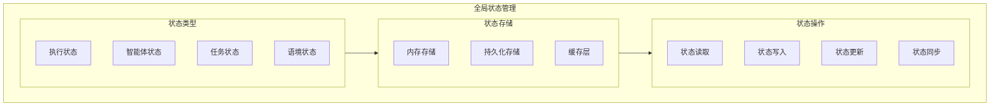

### 语境状态管理

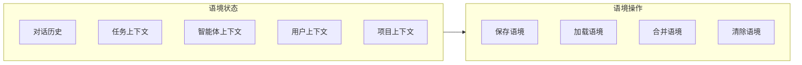

---

## 工作流引擎

### 工作流定义

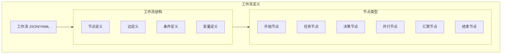

### 工作流执行

```mermaid
flowchart TD
    subgraph Workflow_Execution["工作流执行"]
        PARSER["工作流解析器"]
        VALIDATOR["工作流验证器"]
        EXECUTOR["工作流执行器"]
        MONITOR["工作流监控器"]
    end
    
    subgraph Execution_Flow["执行流程"]
        START["开始"]
        NODE_EXEC["节点执行"]
        CONDITION_CHECK["条件检查"]
        BRANCH_SELECT["分支选择"]
        PARALLEL_EXEC["并行执行"]
        JOIN_WAIT["等待汇聚"]
        END["结束"]
    end
    
    PARSER --> VALIDATOR --> EXECUTOR --> MONITOR
    START --> NODE_EXEC --> CONDITION_CHECK
    CONDITION_CHECK --> BRANCH_SELECT
    BRANCH_SELECT --> PARALLEL_EXEC
    PARALLEL_EXEC --> JOIN_WAIT --> END
```

### 典型工作流示例

#### 新功能开发工作流

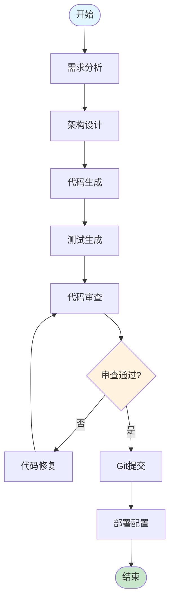

#### Bug修复工作流

```mermaid
flowchart TD
    START([开始]) --> DEBUG[调试分析]
    DEBUG --> LOCATE[Bug定位]
    LOCATE --> FIX[代码修复]
    FIX --> TEST[测试验证]
    TEST --> RESULT{测试通过?}
    
    RESULT -->|否| DEBUG_RETRY[重新调试]
    DEBUG_RETRY --> DEBUG
    
    RESULT -->|是| REVIEW[代码审查]
    REVIEW --> GIT[Git提交]
    GIT --> END([结束])
    
    style START fill:#e1f5ff
    style END fill:#c8e6c9
    style RESULT fill:#fff3e0
```

---

## 智能体注册表

### 智能体发现与管理

```mermaid
flowchart TB
    subgraph Agent_Registry["智能体注册表"]
        subgraph Discovery["智能体发现"]
            AUTO_DISCOVER["自动发现"]
            MANUAL_REGISTER["手动注册"]
            PLUGIN_LOAD["插件加载"]
        end
        
        subgraph Metadata["元数据管理"]
            AGENT_INFO["智能体信息"]
            CAPABILITY_DESC["能力描述"]
            DEPENDENCY_MGMT["依赖管理"]
            VERSION_CTRL["版本控制"]
        end
        
        subgraph Runtime["运行时管理"]
            LIFECYCLE["生命周期管理"]
            HEALTH_CHECK["健康检查"]
            PERF_MONITOR["性能监控"]
            RESOURCE_TRACK["资源追踪"]
        end
    end
    
    Discovery --> Metadata --> Runtime
```

### 智能体能力匹配

```mermaid
flowchart LR
    TASK_REQUIREMENTS["任务需求"] --> CAPABILITY_MATCHER["能力匹配器"]
    
    subgraph Agent_Pool["智能体池"]
        AGENT1["智能体1<br/>能力: A, B, C"]
        AGENT2["智能体2<br/>能力: B, C, D"]
        AGENT3["智能体3<br/>能力: A, D, E"]
    end
    
    CAPABILITY_MATCHER --> SCORING["能力评分"]
    SCORING --> RANKING["智能体排名"]
    RANKING --> SELECTION["最优选择"]
    
    AGENT1 --> SCORING
    AGENT2 --> SCORING
    AGENT3 --> SCORING
```

---

## 核心数据流

### 任务处理完整流程

```mermaid
sequenceDiagram
    participant CLI as CLI层
    participant Nexus as Nexus
    participant Planner as 元规划器
    participant Scheduler as 元调度器
    participant Coordinator as 元协调器
    participant Agent as 专业智能体
    participant Core as 核心服务
    
    CLI->>Nexus: 提交任务
    Nexus->>Planner: 请求任务规划
    Planner->>Planner: 意图识别 & 任务分解
    Planner-->>Nexus: 返回执行计划
    
    Nexus->>Scheduler: 请求调度
    Scheduler->>Scheduler: 智能体选择
    Scheduler-->>Nexus: 返回调度方案
    
    loop 执行每个子任务
        Nexus->>Coordinator: 准备执行
        Coordinator->>Coordinator: 语境准备
        
        Nexus->>Agent: 执行子任务
        Agent->>Core: 调用核心服务
        Core-->>Agent: 返回结果
        Agent-->>Nexus: 返回子任务结果
        
        Nexus->>Coordinator: 更新语境
    end
    
    Nexus->>Coordinator: 整合结果
    Coordinator-->>Nexus: 返回最终结果
    Nexus-->>CLI: 返回给用户
```

---

## 错误处理与恢复

### 错误处理架构

```mermaid
flowchart TD
    subgraph Error_Handling["错误处理"]
        ERROR_DETECT["错误检测"]
        ERROR_CLASSIFY["错误分类"]
        ERROR_ANALYZE["错误分析"]
        
        subgraph Recovery_Strategies["恢复策略"]
            RETRY["重试机制"]
            FALLBACK["回退策略"]
            REROUTE["重新路由"]
            ABORT["中止执行"]
        end
        
        ERROR_LOG["错误日志"]
        ERROR_REPORT["错误报告"]
    end
    
    ERROR_DETECT --> ERROR_CLASSIFY --> ERROR_ANALYZE
    ERROR_ANALYZE --> Recovery_Strategies
    Recovery_Strategies --> ERROR_LOG --> ERROR_REPORT
```

### 重试机制

```mermaid
flowchart LR
    TASK_FAIL["任务失败"] --> CHECK_RETRY{"检查重试条件"}
    
    CHECK_RETRY -->|可以重试| INCREMENT["增加重试计数"]
    CHECK_RETRY -->|不可重试| FALLBACK["执行回退"]
    
    INCREMENT --> DELAY["计算延迟时间"]
    DELAY --> RETRY["重试执行"]
    
    RETRY --> CHECK_MAX{"达到最大重试?"}
    CHECK_MAX -->|否| TASK_FAIL
    CHECK_MAX -->|是| FALLBACK
    
    FALLBACK --> REPORT["报告错误"]
```

---

## 性能优化

### 并发控制

```mermaid
flowchart TB
    subgraph Concurrency_Control["并发控制"]
        THREAD_POOL["线程池管理"]
        SEMAPHORE["信号量控制"]
        RATE_LIMITER["限流器"]
        CIRCUIT_BREAKER["熔断器"]
    end
    
    subgraph Resource_Management["资源管理"]
        CPU_CTRL["CPU控制"]
        MEMORY_CTRL["内存控制"]
        API_QUOTA["API配额管理"]
    end
    
    Concurrency_Control --> Resource_Management
```

### 缓存策略

```mermaid
flowchart LR
    subgraph Cache_Strategy["缓存策略"]
        PLAN_CACHE["计划缓存"]
        AGENT_CACHE["智能体结果缓存"]
        CONTEXT_CACHE["语境缓存"]
        MODEL_CACHE["模型响应缓存"]
    end
    
    subgraph Cache_Policies["缓存策略"]
        LRU["LRU淘汰"]
        TTL["TTL过期"]
        SIZE_LIMIT["大小限制"]
    end
    
    Cache_Strategy --> Cache_Policies
```

---

## 监控与可观测性

### 监控指标

```mermaid
flowchart TB
    subgraph Monitoring_Metrics["监控指标"]
        subgraph Performance_Metrics["性能指标"]
            EXEC_TIME["执行时间"]
            THROUGHPUT["吞吐量"]
            LATENCY["延迟"]
            RESOURCE_USAGE["资源使用"]
        end
        
        subgraph Business_Metrics["业务指标"]
            SUCCESS_RATE["成功率"]
            TASK_COMPLETION["任务完成率"]
            USER_SATISFACTION["用户满意度"]
        end
        
        subgraph System_Metrics["系统指标"]
            AGENT_HEALTH["智能体健康度"]
            QUEUE_DEPTH["队列深度"]
            ERROR_RATE["错误率"]
        end
    end
```

---

## 核心特性对比

| 特性 | 传统模式 | Agently Nexus |
|------|----------|-----------------|
| **执行模式** | 单次执行 | 目标导向的持续执行 |
| **协调方式** | 预设流程 | 技能驱动的动态编排 |
| **智能体协作** | 串行执行 | 能力组合 + 动态替换 |
| **知识复用** | 提示词 | 技能系统 + 自动学习 |
| **语境管理** | 简单上下文 | 多级语境融合 |
| **结果验证** | 无验证 | 自动验证 + 迭代改进 |
| **失败处理** | 简单重试 | 智能分析 + 策略调整 |
| **学习机制** | 无 | 持续学习 + 自动优化 |

---

## 实施路线图

### Phase 1: 基础架构
- 实现 Nexus 五大核心组件
- 建立智能体注册表
- 实现基础工作流引擎

### Phase 2: 技能系统
- 实现 SKILL.md 解析器
- 建立技能注册表
- 实现技能驱动编排

### Phase 3: 持续执行
- 实现目标导向执行循环
- 添加结果验证机制
- 实现自动重试和策略调整

### Phase 4: 能力市场
- 实现细粒度能力定义
- 添加动态组合算法
- 实现运行时监控和替换

### Phase 5: 语境融合
- 实现多级语境管理
- 添加语境融合算法
- 实现语境感知决策

### Phase 6: 学习优化
- 实现性能分析
- 添加策略优化
- 实现自适应调整

---

## 扩展机制

### 自定义协调策略

```python
# 示例：自定义调度策略
from agently.orchestrator import SchedulingStrategy, Task, Agent

class MyCustomStrategy(SchedulingStrategy):
    def select_agent(self, task: Task, available_agents: List[Agent]) -> Agent:
        # 自定义选择逻辑
        best_agent = None
        best_score = 0
        
        for agent in available_agents:
            score = self.calculate_score(task, agent)
            if score > best_score:
                best_score = score
                best_agent = agent
        
        return best_agent
    
    def calculate_score(self, task: Task, agent: Agent) -> float:
        # 自定义评分逻辑
        capability_score = agent.match_capability(task.requirements)
        performance_score = agent.get_recent_performance()
        load_score = 1.0 - agent.get_current_load()
        
        return capability_score * 0.5 + performance_score * 0.3 + load_score * 0.2
```

### 自定义工作流节点

```python
# 示例：自定义工作流节点
from agently.orchestrator import WorkflowNode, NodeContext

class CustomAnalysisNode(WorkflowNode):
    def __init__(self, config: dict):
        super().__init__(config)
        self.analysis_type = config.get('analysis_type', 'general')
    
    async def execute(self, context: NodeContext) -> NodeResult:
        # 自定义执行逻辑
        input_data = context.get_input()
        
        # 执行分析
        result = await self.perform_analysis(input_data)
        
        # 更新语境
        context.set_output(result)
        context.update_state({'analysis_complete': True})
        
        return NodeResult(success=True, data=result)
    
    async def perform_analysis(self, data: dict) -> dict:
        # 具体的分析逻辑
        pass
```

---

## 总结

智能体协调层是 Agently 的核心，通过 Nexus 综合智能体实现：

1. **编排优先**：真正的多智能体协作，而非单智能体串行执行
2. **技能驱动**：以技能为核心组织智能体协作
3. **持续执行**：不解决问题不罢休的目标导向执行模式
4. **能力组合**：细粒度能力的动态组合和运行时优化
5. **语境感知**：多级语境的智能融合和动态应用
6. **自动优化**：从执行中持续学习和自适应调整

这一层的设计使得 Agently 能够像一位经验丰富的技术负责人一样，统筹协调多个专业智能体，高效完成复杂的软件开发任务。

---

**文档版本**: v1.0  
**最后更新**: 2026-03-07  
**维护者**: Agently 开发团队